# Technical Architecture & System Integration Design

## OPAL Parametric Flood Insurance Platform

**Project:** DPA Foundation — OPAL Platform  
**Version:** 1.0  
**Blockchain:** Polygon PoS (Mainnet 137 / Testnet Amoy 80002)  
**Solidity:** ^0.8.22 (compiled 0.8.28)

---

## Table of Contents

1. [System Architecture Overview](#1-system-architecture-overview)
2. [Contract Architecture](#2-contract-architecture)
3. [Upgrade Architecture](#3-upgrade-architecture)
4. [Data Flow Architecture](#4-data-flow-architecture)
5. [Oracle Architecture](#5-oracle-architecture)
6. [Payment Architecture](#6-payment-architecture)
7. [Governance Architecture](#7-governance-architecture)
8. [Privacy Architecture](#8-privacy-architecture)
9. [Compliance Architecture](#9-compliance-architecture)
10. [Network Architecture](#10-network-architecture)
11. [Integration Points](#11-integration-points)
12. [Storage Design](#12-storage-design)
13. [Access Control Architecture](#13-access-control-architecture)
14. [Error Handling Architecture](#14-error-handling-architecture)
15. [Gas Optimization](#15-gas-optimization)

---

## 1. System Architecture Overview

### 1.1 High-Level Architecture

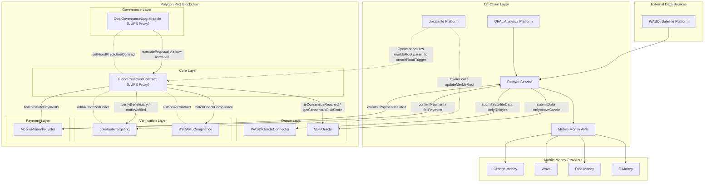


### 1.2 Hub-and-Spoke Pattern

FloodPredictionContract serves as the **central orchestrator** (hub) connecting all peripheral contracts (spokes):

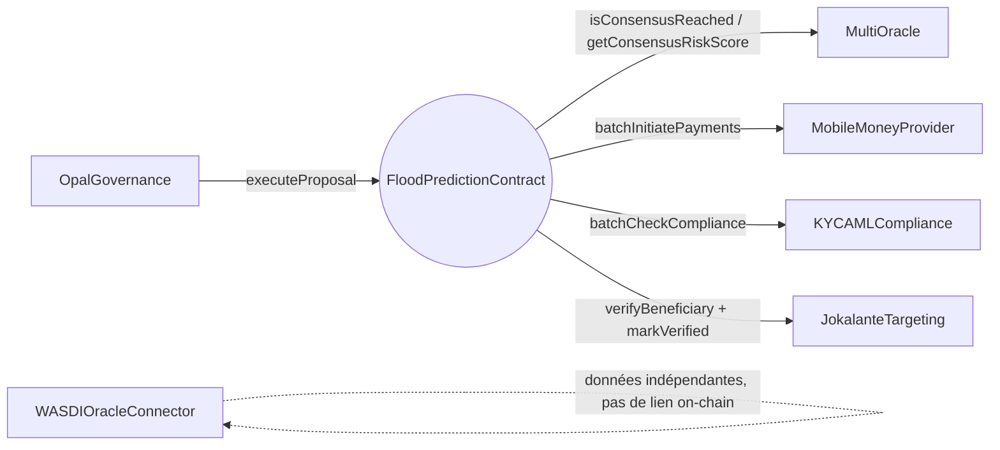


## 2. Contract Architecture

### 2.1 Contract Registry

| Contract | Type | Inheritance | Lines | Storage Gap |
|----------|------|-------------|-------|-------------|
| FloodPredictionContract | UUPS Proxy | Initializable, AccessControlUpgradeable, UUPSUpgradeable, PausableUpgradeable, ReentrancyGuardTransient | ~994 | `__gap[48]` *(réduit de 49 — ajout oracleTolerance, fix H-3)* |
| OpalGovernanceUpgradeable | UUPS Proxy | Initializable, Ownable2StepUpgradeable, UUPSUpgradeable | 508 | `__gap[47]` |
| MultiOracle | Standard | Ownable2Step, ReentrancyGuard | 950 | None |
| JokalanteTargeting | Standard | Ownable2Step | 323 | None |
| MobileMoneyProvider | Standard | Ownable2Step, Pausable, ReentrancyGuard | 619 | None |
| KYCAMLCompliance | Standard | Ownable2Step | 491 | None |
| WASDIOracleConnector | Standard | Ownable2Step, Pausable, ReentrancyGuard | 510 | None |
| FloodPredictionLib | Library | — | 111 | None |

### 2.2 Inheritance Hierarchy

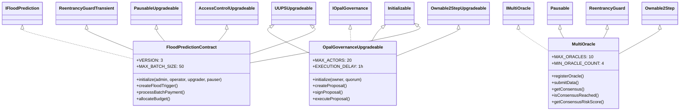

### 2.3 Interface Design

| Interface | Enums | Structs | Functions | Events |
|-----------|-------|---------|-----------|--------|
| IFloodPrediction | TriggerStatus(7), RiskLevel(4) | FloodTrigger(14), BudgetAllocation(5) | 21 | 4 |
| IMultiOracle | — | OracleData(5), ConsensusResult(6), OracleInfo(8) | 10 | 7 |
| IOpalGovernance | ProposalStatus(5), ProposalType(5) | Proposal(12), GovernanceActor(7) | 12 | 8 |
| IJokalanteTargeting | — | TargetingCriteria(7) | 9 | 5 |
| IMobileMoneyProvider | PaymentStatus(5) | Payment(10) | 10 | 6 |
| IKYCAMLCompliance | VerificationStatus(6), RiskLevel(4) | ComplianceAttestation(8), ScreeningResult(5) | 9 | 8 |
| IWASDIOracle | — | SatelliteData(8) | 7 | 3 |

---

## 3. Upgrade Architecture

### 3.1 UUPS Proxy Pattern

Only **two contracts** use the UUPS proxy pattern:

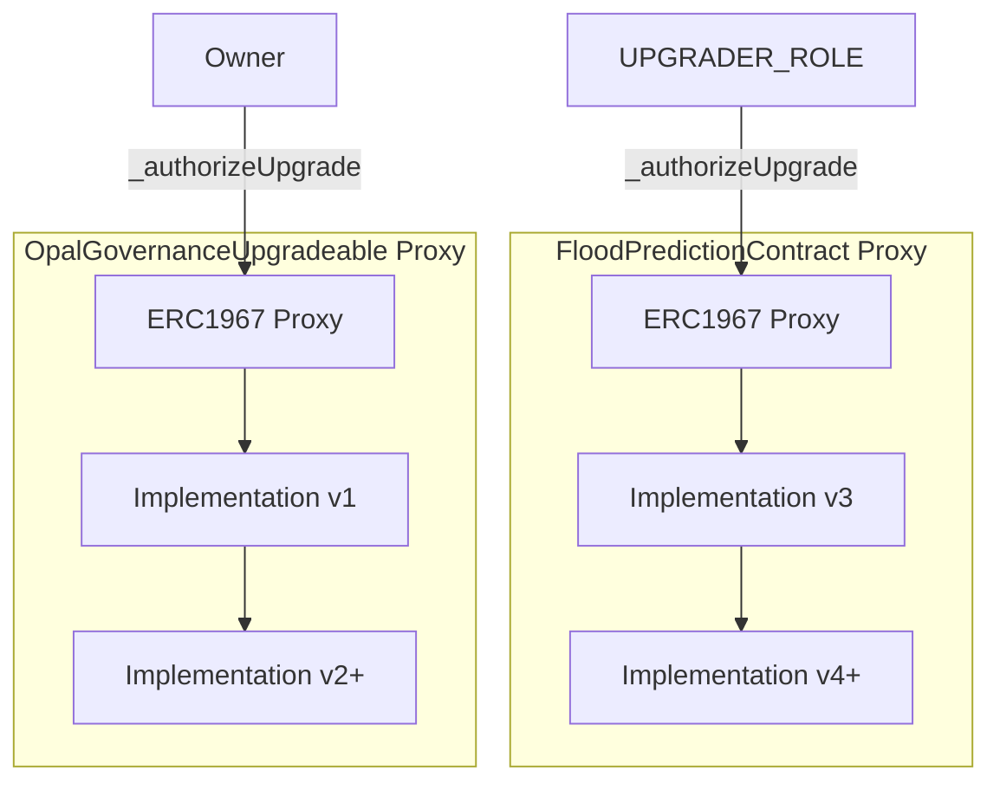

### 3.2 Storage Gap Configuration

| Contract | Gap Size | Used Slots | Purpose |
|----------|----------|------------|---------|
| FloodPredictionContract | `__gap[48]` | 24 state variables (+ inherited OpenZeppelin slots) | Future storage expansion |
| OpalGovernanceUpgradeable | `__gap[47]` | 15 state variables (+ inherited OpenZeppelin slots) | Future storage expansion |

### 3.3 Upgrade Safety

- **FloodPredictionContract**: Protected by `UPGRADER_ROLE` in `_authorizeUpgrade()`
- **OpalGovernanceUpgradeable**: Protected by `onlyOwner` + governance approval (`approvedUpgrades[newImplementation]`) in `_authorizeUpgrade()`
- **Initializer guard**: `initializer` modifier prevents re-initialization
- **Storage layout**: Compatible with OpenZeppelin UUPS pattern

### 3.4 Non-Upgradeable Contracts

The remaining 5 contracts (MultiOracle, JokalanteTargeting, MobileMoneyProvider, KYCAMLCompliance, WASDIOracleConnector) are **standard (non-upgradeable)** contracts. They use `Ownable2Step` for ownership management and do not require upgrade capability since they can be replaced by updating addresses in FloodPredictionContract.

---

## 4. Data Flow Architecture

### 4.1 End-to-End Flow: Satellite Data → Mobile Money Payout

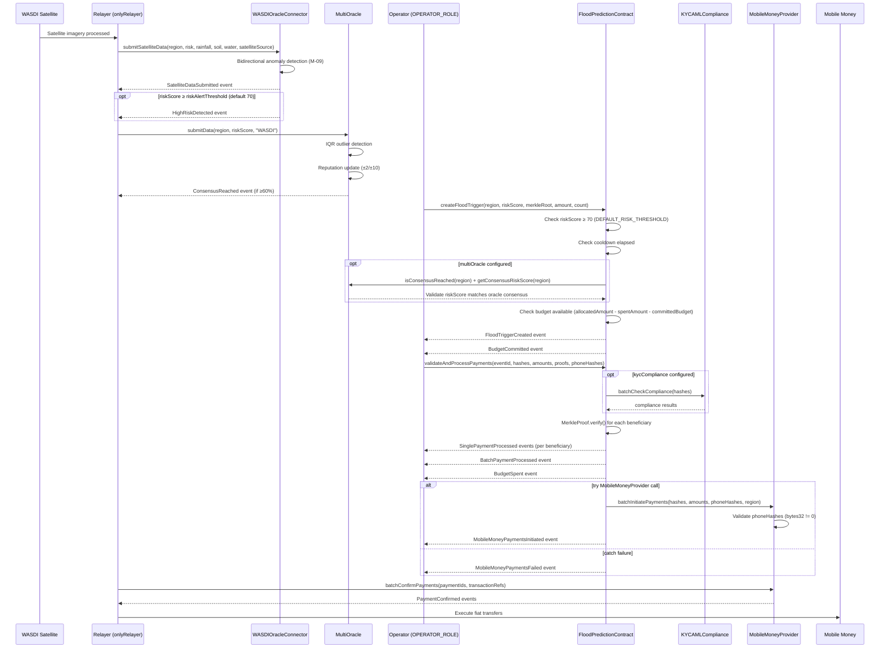

### 4.2 Trigger State Machine

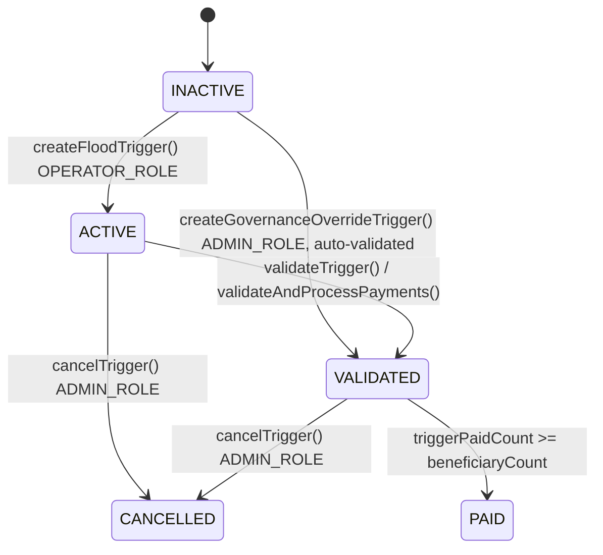

> **Note :** Les états `PENDING` (1) et `EXPIRED` (5) sont définis dans l'enum `TriggerStatus` mais ne sont jamais assignés par aucune fonction du contrat (dead code réservé pour une implémentation future).

**TriggerStatus Enum Values:**
| Value | Name | Description |
|-------|------|-------------|
| 0 | INACTIVE | Default / non-existent |
| 1 | PENDING | Reserved (dead code — jamais assigné) |
| 2 | ACTIVE | Trigger created, awaiting validation |
| 3 | VALIDATED | Validated, ready for payments |
| 4 | PAID | All payments complete (triggerPaidCount ≥ beneficiaryCount) |
| 5 | EXPIRED | Reserved (dead code — jamais assigné, aucun mécanisme d'expiry implémenté) |
| 6 | CANCELLED | Cancelled by admin |

### 4.3 Adaptive Cooldown

`createFloodTrigger()` enforces a per-region cooldown based on risk level (via `FloodPredictionLib.calculateCooldown()`):

| Risk Level | Condition | Cooldown |
|------------|-----------|----------|
| CRITICAL | riskScore ≥ 90 | 10 minutes (`COOLDOWN_CRITICAL`) |
| HIGH | riskScore ≥ riskThreshold | 30 minutes (`COOLDOWN_HIGH`) |
| NORMAL | riskScore < riskThreshold | 1 hour (`COOLDOWN_NORMAL`) |

Le cooldown est calculé dynamiquement : plus le risque est élevé, plus la période de cooldown est courte, permettant une réponse rapide en situation critique.

---

## 5. Oracle Architecture

### 5.1 Multi-Oracle Consensus

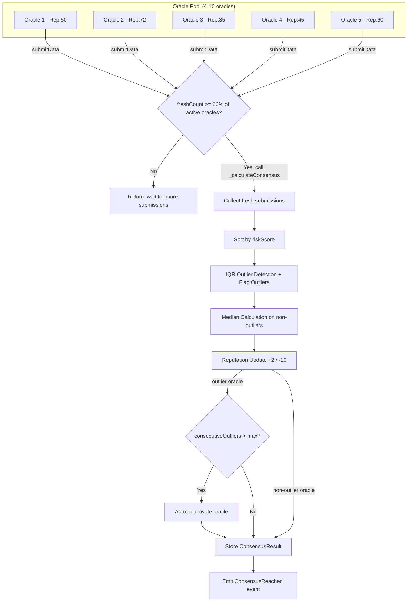

### 5.2 IQR Outlier Detection Algorithm

```
1. Sort all oracle submissions by riskScore
2. Calculate Q1 (25th percentile) and Q3 (75th percentile)
3. IQR = Q3 - Q1
4. Lower bound = Q1 - (IQR × 3/2)
5. Upper bound = Q3 + (IQR × 3/2)
6. Flag submissions outside bounds as outliers
7. Penalize outlier oracles: reputation -= 10
8. Reward aligned oracles: reputation += 2
9. Probation warning at maxConsecutiveOutliers (default 3) consecutive outliers
10. Auto-deactivate oracle after maxConsecutiveOutliers + 1 (4) consecutive outliers
```

### 5.3 Oracle Configuration

| Parameter | Value | Setter |
|-----------|-------|--------|
| MAX_ORACLES | 10 | Constant |
| MIN_ORACLE_COUNT | 4 | Constant |
| consensusThreshold | 60% | `setConsensusThreshold()` |
| dataFreshnessThreshold | 1 hour | `setDataFreshnessThreshold()` |
| maxConsecutiveOutliers | 3 | `setMaxConsecutiveOutliers()` |
| INITIAL_REPUTATION | 50 | Constant |
| MAX_REPUTATION | 100 | Constant |
| REPUTATION_BONUS | +2 | Constant |
| REPUTATION_PENALTY | -10 | Constant |

### 5.4 WASDI Oracle Bridge

WASDIOracleConnector serves as the bridge between WASDI satellite platform and MultiOracle:

| Parameter | Value |
|-----------|-------|
| MAX_RAINFALL | 2,000 mm |
| MAX_SOIL_MOISTURE | 100% |
| MAX_WATER_LEVEL | 10,000 cm |
| _freshnessThreshold | 6 hours (configurable via `setFreshnessThreshold()`, 30min–7d) |
| ANOMALY_THRESHOLD | 40 (constant, détection bidirectionnelle des anomalies > 40 points) |
| riskAlertThreshold | 70 (configurable via `setRiskAlertThreshold()`, 1–100, seuil pour `HighRiskDetected`) |
| productionLocked | Irreversible (H-06 fix) |

**Satellite Sources:** Sentinel-1 (SAR), Sentinel-2 (optical), MODIS (thermal), Landsat-8 (multispectral), Landsat-9 (multispectral), VIIRS (thermal/fire)

---

## 6. Payment Architecture

### 6.1 Mobile Money Integration

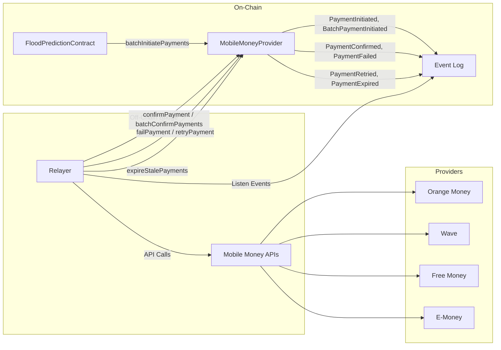

### 6.2 Provider Selection (Parameter-Based)

Le fournisseur Mobile Money est fourni en paramètre avec les données du bénéficiaire. Un même fournisseur peut servir n'importe quel numéro de téléphone, indépendamment du préfixe télécom.

L'enum `MobileProvider` est défini dans `IMobileMoneyProvider.sol` :

| Provider | Enum Value | API |
|----------|-----------|-----|
| Orange Money | 0 | Orange Money API v3 |
| Wave | 1 | Wave Business API |
| Free Money | 2 | Free Money B2B |
| E-Money | 3 | SGBS E-Money |

**Signatures mises à jour :**
- `initiatePayment(bytes32, uint256, bytes32, string, MobileProvider)`
- `batchInitiatePayments(bytes32[], uint256[], bytes32[], string, MobileProvider[])`
- `processBatchPayment(string, bytes32[], uint256[], bytes32[][], bytes32[], MobileProvider[])`
- `validateAndProcessPayments(string, bytes32[], uint256[], bytes32[][], bytes32[], MobileProvider[])`

Le compteur `providerPaymentCount[MobileProvider]` suit le nombre de paiements par fournisseur.

### 6.3 Payment State Machine

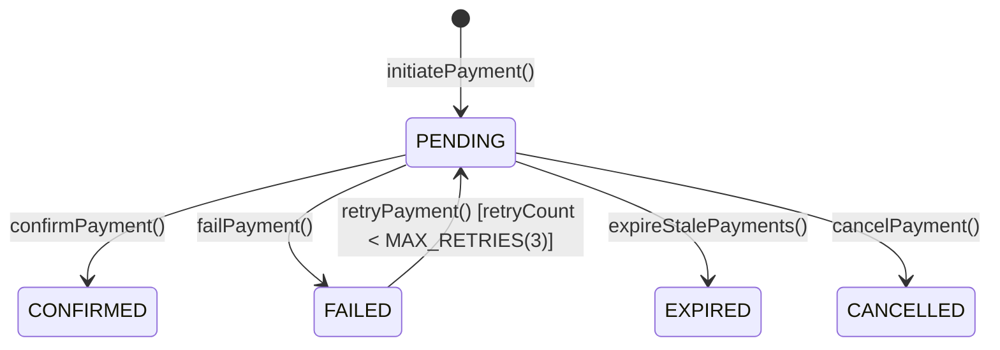

**PaymentStatus Enum Values:** PENDING(0), CONFIRMED(1), FAILED(2), EXPIRED(3), CANCELLED(4) — there is no NONE state.

### 6.4 Payment Configuration

| Parameter | Value |
|-----------|-------|
| MIN_PAYMENT_AMOUNT | 500 FCFA |
| MAX_PAYMENT_AMOUNT | 5,000,000 FCFA |
| MAX_BATCH_SIZE | 50 |
| MAX_RETRIES | 3 |
| DEFAULT_TIMEOUT | 30 minutes |
| MAX_TIMEOUT | 24 hours |
| MIN_TIMEOUT | 5 minutes |

### 6.5 Duplicate Payment Prevention (H8-MMP Fix)

MobileMoneyProvider rejects duplicate payment initiation for the same `beneficiaryHash` + `eventId` combination, preventing double-spend at the payment layer.

---

## 7. Governance Architecture

### 7.1 Multi-Sig Governance

OpalGovernanceUpgradeable implements **sign-based governance** (not voting):

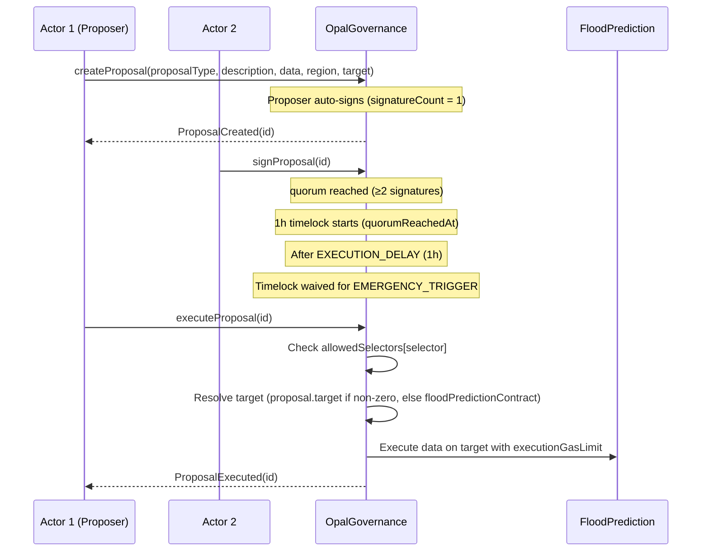

### 7.2 Rejection & Expiry Mechanism

**`rejectProposal()`** — Two rejection paths:
- **Owner**: Rejection instantanée et unilatérale (pas de quorum nécessaire).
- **Governance Actors**: Chaque acteur actif peut rejeter. Lorsque `rejectionCount ≥ quorum`, la proposition est rejetée (M-01v2 fix: compteur de rejets séparé des signatures d'approbation). Un acteur ne peut pas signer ET rejeter la même proposition.

**`expireProposal()`** — Callable par n'importe qui. La proposition doit être `PENDING` et `block.timestamp > deadline`. Émet `ProposalExpired`.

### 7.3 Proposal Types

| Type | Value | Deadline | Timelock |
|------|-------|----------|----------|
| EMERGENCY_TRIGGER | 0 | 4 hours | **Waived** |
| PARAMETER_CHANGE | 1 | 24 hours | 1 hour |
| BUDGET_ALLOCATION | 2 | 24 hours | 1 hour |
| UPGRADE | 3 | 24 hours | 1 hour |
| ORACLE_OVERRIDE | 4 | 24 hours | 1 hour |

### 7.4 Governance Configuration

| Parameter | Value |
|-----------|-------|
| MAX_ACTORS | 20 |
| MIN_QUORUM | 2 |
| DEFAULT_DEADLINE | 24 hours |
| EMERGENCY_DEADLINE | 4 hours |
| EXECUTION_DELAY | 1 hour (M-10 fix) |
| executionGasLimit | 500,000 |

### 7.5 Selector Whitelist (H4-GOV Fix)

`executeProposal()` validates that the function selector in `callData` is whitelisted via `allowedSelectors[bytes4]`. This prevents governance from executing arbitrary functions on the target contract.

### 7.6 Explicit Execution Target (H-2 Fix — Audit Round 2)

The `Proposal` struct now includes a `target address` field (13th field). When `createProposal()` is called with a non-zero `target`, governance executes `callData` against that explicit target instead of defaulting to `floodPredictionContract`. This enables governance to operate on any contract (e.g., `MultiOracle`, `KYCAMLCompliance`) without code changes. Backward-compatible: zero address falls back to `floodPredictionContract`.

---

## 8. Privacy Architecture

### 8.1 Merkle Tree Beneficiary Verification

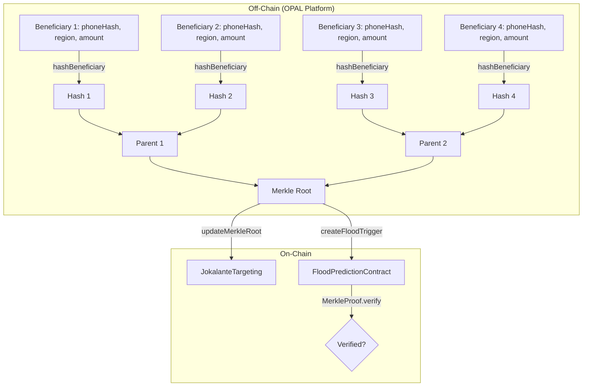

### 8.2 Hash Function (H-01 / H-11 Fix)

```solidity
// FloodPredictionLib.hashBeneficiary — double-hash pattern (V-01 fix: second preimage resistance)
function hashBeneficiary(
    bytes32 phoneHash,
    string memory region,
    uint256 amount
) internal pure returns (bytes32) {
    return keccak256(bytes.concat(keccak256(abi.encode(phoneHash, region, amount))));
}
```

**Double-hash pattern (`keccak256(bytes.concat(keccak256(...)))`):** Protects contre les attaques par seconde pré-image sur les preuves Merkle (V-01 fix). Utilise `abi.encode` (et non `abi.encodePacked`) pour éviter les collisions de hash. Les 3 paramètres (`phoneHash`, `region`, `amount`) permettent un engagement cryptographique complet du bénéficiaire.

### 8.3 Privacy Guarantees

| Data Type | On-Chain | Off-Chain |
|-----------|----------|-----------|
| Beneficiary name | ❌ (hashed) | ✅ (OPAL) |
| Phone number | ❌ (hashed) | ✅ (OPAL) |
| National ID | ❌ (hashed) | ✅ (OPAL) |
| Payment amount | ✅ | ✅ |
| Region | ✅ | ✅ |
| Merkle root | ✅ | ✅ |
| Merkle proof | ✅ (per-verification) | ✅ |

---

## 9. Compliance Architecture

### 9.1 KYC/AML Flow

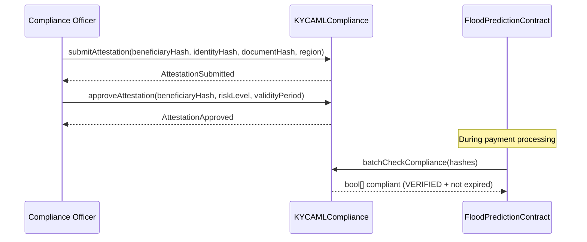

### 9.2 Verification Status Machine

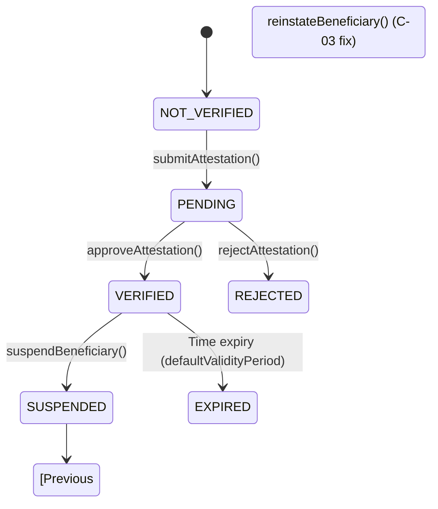

**VerificationStatus Enum Values:** NOT_VERIFIED(0), PENDING(1), VERIFIED(2), REJECTED(3), EXPIRED(4), SUSPENDED(5)

### 9.3 Compliance Configuration

| Parameter | Value |
|-----------|-------|
| defaultValidityPeriod | 365 days |
| maxValidityPeriod | 730 days |
| fraudThreshold | 3 alerts → auto-suspension |

**Key Behaviors:**
- Only `SANCTIONED` status triggers automatic suspension (not HIGH risk)
- `reinstateBeneficiary()` restores the **previous status** (C-03 fix), not a default
- `batchCheckCompliance()` checks both VERIFIED status AND non-expired attestation

---

## 10. Network Architecture

### 10.1 Configured Networks

| Network | Chain ID | RPC | Purpose |
|---------|----------|-----|---------|
| Hardhat (EDR) | 1337 | In-process | Unit testing |
| Localhost | 31337 | http://127.0.0.1:8545 | Local development |
| Polygon PoS | 137 | polygon-mainnet.infura.io | Production |
| Polygon Amoy | 80002 | polygon-amoy.infura.io | Testnet |
| Sepolia | 11155111 | sepolia.infura.io | Ethereum testnet |
| Arbitrum | 42161 | arb1.arbitrum.io/rpc | Alternative L2 |
| Arbitrum Sepolia | 421614 | sepolia-rollup.arbitrum.io | L2 testnet |

### 10.2 Deployment Architecture

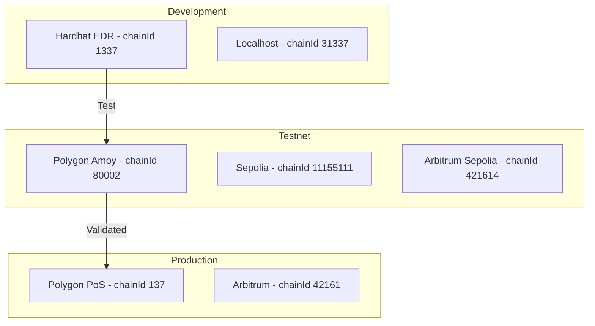

### 10.3 Hardhat Configuration

```javascript
// Key settings from hardhat.config.js
solidity: {
  version: "0.8.28",
  settings: {
    optimizer: { enabled: true, runs: 200 },
    viaIR: true
  }
}
// EDR: blockGasLimit 60_000_000, hardfork "cancun"
// Mocha: timeout 120_000ms
```

---

## 11. Integration Points

### 11.1 Contract-to-Contract Integration

| Source | Target | Function Call | Direction |
|--------|--------|---------------|-----------|
| FloodPredictionContract | KYCAMLCompliance | `batchCheckCompliance(hashes)` | FPC → KYC |
| FloodPredictionContract | MobileMoneyProvider | `batchInitiatePayments(...)` | FPC → MMP |
| FloodPredictionContract | MultiOracle | `isConsensusReached(region)` + `getConsensusRiskScore(region)` | FPC → MO (read) |
| FloodPredictionContract | JokalanteTargeting | `verifyBeneficiary(region, hash, amount, proof)` + `markVerified(region, hash)` | FPC → JKT *(H-1 fix — Audit Round 2)* |
| OpalGovernance | FloodPredictionContract (or explicit target) | `executeProposal(callData)` routed to `proposal.target` | GOV → target *(H-2 fix — Audit Round 2)* |
| WASDIOracleConnector | MultiOracle | Via relayer | WASDI → (off-chain) → MO |

### 11.2 External Integration Points

| Integration | Protocol | Direction | Component |
|-------------|----------|-----------|-----------|
| WASDI Satellite | REST API → Relayer → submitSatelliteData() | Inbound | WASDIOracleConnector |
| Orange Money | REST API via Relayer | Outbound | MobileMoneyProvider |
| Wave | REST API via Relayer | Outbound | MobileMoneyProvider |
| Free Money | REST API via Relayer | Outbound | MobileMoneyProvider |
| E-Money | REST API via Relayer | Outbound | MobileMoneyProvider |
| OPAL Platform | Event listener + API | Bidirectional | All contracts |

### 11.3 Event-Driven Architecture

All contracts emit events that the off-chain relayer and OPAL platform can subscribe to:

| Contract | Key Events | Total |
|----------|-----------|-------|
| FloodPredictionContract | FloodTriggerCreated, BatchPaymentProcessed, BudgetAllocated, EmergencyModeActivated, MobileMoneyPaymentsInitiated/Failed | 18 |
| MultiOracle | ConsensusReached, DataSubmitted, OutlierDetected, ReputationUpdated | 12 |
| OpalGovernanceUpgradeable | ProposalCreated, ProposalSigned, ProposalExecuted, ProposalRejected | 9 |
| MobileMoneyProvider | PaymentInitiated, PaymentConfirmed, PaymentFailed, BatchPaymentInitiated | 12 |
| KYCAMLCompliance | AttestationApproved, BeneficiarySuspended, FraudAlertRaised | 10 |
| WASDIOracleConnector | SatelliteDataSubmitted, HighRiskDetected, AnomalyDetected | 11 |
| JokalanteTargeting | MerkleRootUpdated, BeneficiaryVerified, RegionDeactivated | 5 |

---

## 12. Storage Design

### 12.1 FloodPredictionContract Storage Layout

| Slot Range | Variable | Type |
|------------|----------|------|
| Inherited | AccessControl storage | OpenZeppelin |
| Inherited | Pausable storage | OpenZeppelin |
| State | `triggers` | mapping(string → FloodTrigger) |
| State | `triggerIds` | string[] |
| State | `triggerCount` | uint256 |
| State | `budgets` | mapping(string → BudgetAllocation) |
| State | `budgetRegions` | string[] |
| State | `totalBudgetAllocated` | uint256 |
| State | `totalBudgetSpent` | uint256 |
| State | `paymentRecords` | mapping(bytes32 → PaymentRecord) |
| State | `totalPaymentsProcessed` | uint256 |
| State | `totalAmountDisbursed` | uint256 |
| State | `triggerPaidCount` | mapping(string → uint256) |
| State | `committedBudget` | mapping(string → uint256) |
| State | `triggerSpentAmount` | mapping(string → uint256) |
| State | `regionNonces` | mapping(string → uint256) |
| State | `globalNonce` | uint256 |
| State | `lastTriggerTimestamp` | mapping(string → uint256) |
| State | `riskThreshold` | uint256 |
| State | `multiOracle` | address |
| State | `governance` | address |
| State | `jokalanteTargeting` | address |
| State | `mobileMoneyProvider` | address |
| State | `kycCompliance` | address |
| State | `emergencyMode` | bool |
| State | `regionEmergency` | mapping(string → bool) |
| Gap | `__gap[48]` | uint256[48] |

### 12.2 Data Structures

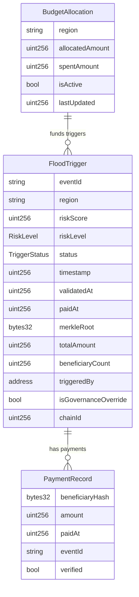

> **Note:** Multi-batch progress is tracked via separate mappings: `triggerPaidCount` (per trigger), `triggerSpentAmount` (per trigger), and `committedBudget` (per region).

---

## 13. Access Control Architecture

### 13.1 Role-Based Access (FloodPredictionContract)

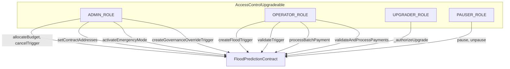

### 13.2 Ownership-Based Access (Standard Contracts)

| Contract | Owner Functions | Custom Modifiers |
|----------|----------------|------------------|
| MultiOracle | registerOracle, deactivateOracle, setConsensusThreshold | onlyOracle, onlyActiveOracle |
| JokalanteTargeting | updateMerkleRoot, addAuthorizedCaller | onlyAuthorizedCaller |
| MobileMoneyProvider | addRelayer, setTimeout, setDailyLimit | onlyRelayer |
| KYCAMLCompliance | addComplianceOfficer, authorizeContract | onlyComplianceOfficer |
| WASDIOracleConnector | addRelayer, lockProductionMode, setFreshnessThreshold | onlyRelayer |

### 13.3 Two-Step Ownership Transfer

All standard contracts inherit `Ownable2Step`, requiring the new owner to explicitly accept ownership via `acceptOwnership()`. This prevents accidental ownership transfer to incorrect addresses.

---

## 14. Error Handling Architecture

### 14.1 Custom Error Strategy

All contracts use Solidity custom errors (gas-efficient) instead of `require()` with string messages:

| Contract | Custom Errors |
|----------|--------------|
| FloodPredictionContract | 23 errors (InvalidRiskScore, InsufficientBudget, CooldownNotElapsed, etc.) |
| MultiOracle | 15 errors |
| OpalGovernanceUpgradeable | 20 errors |
| JokalanteTargeting | 11 errors |
| MobileMoneyProvider | 19 errors |
| KYCAMLCompliance | 17 errors |
| WASDIOracleConnector | 14 errors |

### 14.2 Input Validation at Boundaries

| Boundary | Validations |
|----------|-------------|
| Risk score | 0 ≤ score ≤ 100 |
| Region string | Length ≤ 20 characters |
| Payment amount | 500 ≤ amount ≤ 5,000,000 FCFA |
| Batch size | 1 ≤ size ≤ 50 |
| Phone hash | Non-zero bytes32 (`phoneHash != bytes32(0)`) |
| Address | Non-zero address check |
| Array parity | Lengths must match for parallel arrays |

---

## 15. Gas Optimization

### 15.1 Optimization Techniques

| Technique | Location | Impact |
|-----------|----------|--------|
| `ReentrancyGuardTransient` (EIP-1153) | FloodPredictionContract | Transient storage: ~100 gas vs ~5000 |
| `viaIR: true` | Compiler settings | Better stack optimization |
| Optimizer runs: 200 | Compiler settings | Balanced deploy/runtime cost |
| Custom errors | All contracts | ~200 gas saved vs `require` strings |
| Batch operations | FPC, MMP, KYC | Amortize transaction overhead |
| Paginated views | FPC (`getTriggerIdsPaginated`) | Bounded gas for large datasets |
| Mapping over arrays | Primary storage pattern | O(1) lookups |

### 15.2 Gas Limits

| Configuration | Value |
|---------------|-------|
| Block gas limit (EDR) | 60,000,000 |
| Governance execution gas limit | 500,000 |
| Mocha test timeout | 120,000 ms |

---

## Appendix A: Deployment Scripts

| Script | Purpose | Networks |
|--------|---------|----------|
| deploy-v3.js | Quick local deployment (non-proxy) | Hardhat/Localhost |
| deploy-upgradeable.js | Full UUPS proxy deployment with wiring | All networks |
| deploy-amoy.js | Polygon Amoy deployment (resumable, 6 regions) | Amoy (80002) |
| upgrade-contract.js | UUPS proxy upgrade | Any network |
| interactive-test.js | End-to-end integration test | Localhost |
| stress-test-1000.js | Performance: 200 triggers, 1000 payments | Localhost |
| patch-edr-gas-cap.js | Post-install HH3 EDR gas cap fix | N/A |

## Appendix B: Technology Stack Summary

| Component | Technology | Version |
|-----------|-----------|---------|
| Smart Contracts | Solidity | ^0.8.22 (0.8.28) |
| Framework | Hardhat | 3.x |
| Standards Library | OpenZeppelin Contracts | ^5.4.0 |
| Upgrades Plugin | @openzeppelin/hardhat-upgrades | 4.0.0-alpha.0 |
| Testing | Mocha + Chai | ^11.0.0 / ^5.1.2 |
| Ethereum Library | Ethers.js | ^6.14.0 |
| Merkle Trees | merkletreejs | ^0.6.0 |
| Linter | Solhint | ^6.1.0 |
| Package Version | flood-prediction-smart-contract | 4.0.0 |

---

*Document based on verified codebase analysis — 7 contracts, 1 library, 7 interfaces, 3 mocks, 339/339 tests passing.*
