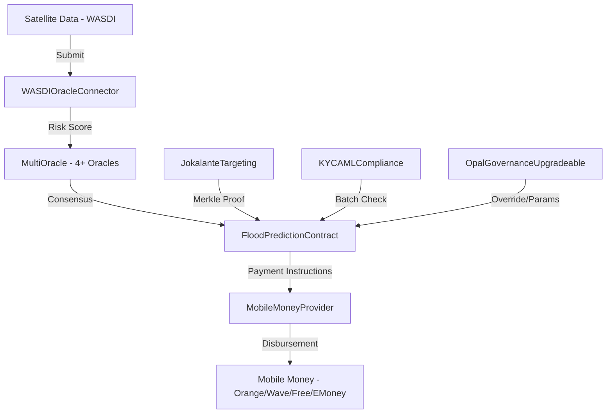

# Blockchain Use Case Assessment

## Analysis of Blockchain Suitability for the OPAL Flood Insurance Platform

**Project:** DPA Foundation — OPAL Parametric Flood Insurance  
**Version:** 1.0  
**Network:** Polygon PoS (Mainnet 137 / Testnet Amoy 80002)

---

## Table of Contents

1. [Executive Summary](#1-executive-summary)
2. [Project Context](#2-project-context)
3. [Problem Statement](#3-problem-statement)
4. [Why Blockchain?](#4-why-blockchain)
5. [Blockchain Suitability Analysis](#5-blockchain-suitability-analysis)
6. [Technology Selection](#6-technology-selection)
7. [Use Case Mapping](#7-use-case-mapping)
8. [Risk Assessment](#8-risk-assessment)
9. [Cost-Benefit Analysis](#9-cost-benefit-analysis)
10. [Recommendation](#10-recommendation)

---

## 1. Executive Summary

This assessment evaluates the suitability of blockchain technology for the DPA Foundation's OPAL parametric flood insurance platform in Senegal. The platform automates flood insurance payouts to vulnerable populations using satellite data (WASDI), multi-oracle consensus, privacy-preserving beneficiary targeting (Merkle trees), and Mobile Money disbursement (Orange Money, Wave, Free Money, E-Money).

**Conclusion:** Blockchain is **well-suited** for this use case due to requirements for transparency, immutable audit trails, automated rule enforcement via smart contracts, and multi-stakeholder trust in a parametric insurance context.

---

## 2. Project Context

### 2.1 Stakeholders

| Stakeholder | Role |
|------------|------|
| DPA Foundation | Project owner, governance authority |
| OPAL Platform | Integration partner, data analytics |
| Beneficiaries | Flood-affected populations in Senegal |
| Oracle Providers | Satellite data sources (WASDI — Sentinel-1, Sentinel-2, MODIS, Landsat-8, Landsat-9, VIIRS) |
| Mobile Money Operators | Payment disbursement (Orange Money, Wave, Free Money, E-Money) |
| Compliance Officers | KYC/AML verification |
| Government/Regulators | Oversight and regulatory compliance |

### 2.2 Geographic Scope

The platform targets flood-prone regions in Senegal, with pre-configured regions including:
- Saint-Louis (river flooding)
- Thiès (urban flooding)
- Kaffrine (agricultural flooding)
- Dakar, Ziguinchor, Matam

### 2.3 Scale

- Up to **50,000 beneficiaries per region** (JokalanteTargeting.maxBeneficiariesPerRegion)
- Batch processing of **50 payments per transaction** (FloodPredictionContract.MAX_BATCH_SIZE)
- Payment range: **500 — 5,000,000 FCFA** per beneficiary
- Tested at scale: 5,000 beneficiary batch processing verified

---

## 3. Problem Statement

### 3.1 Traditional Insurance Challenges in Senegal

| Challenge | Description |
|-----------|-------------|
| **Slow Claims Processing** | Manual verification delays payouts by weeks or months |
| **Lack of Transparency** | Beneficiaries cannot verify fund allocation or disbursement |
| **Fraud Risk** | Manual processes are susceptible to manipulation |
| **Exclusion** | Vulnerable populations lack access to traditional insurance |
| **Trust Deficit** | Multiple intermediaries reduce confidence in fair processing |
| **Audit Difficulty** | Paper-based records are hard to audit retroactively |

### 3.2 Parametric Insurance Solution

Parametric insurance eliminates subjective claims assessment by using predefined parameters (satellite-measured flood risk scores) to trigger automatic payouts. This requires:

- **Objective data feeds** — satellite-derived risk scores
- **Automated triggers** — rule-based payout activation
- **Transparent record-keeping** — auditable disbursement trail
- **Multi-party trust** — consensus among independent data providers

---

## 4. Why Blockchain?

### 4.1 Blockchain Value Propositions for This Use Case

```
┌──────────────────────────────────────────────────────────┐
│              BLOCKCHAIN VALUE PROPOSITIONS                │
├──────────────┬───────────────────────────────────────────┤
│ Immutability │ Flood triggers, payments, and governance  │
│              │ decisions recorded permanently on-chain   │
├──────────────┼───────────────────────────────────────────┤
│ Transparency │ All stakeholders can verify fund flows    │
│              │ and trigger conditions independently      │
├──────────────┼───────────────────────────────────────────┤
│ Automation   │ Smart contracts enforce payout rules      │
│              │ without manual intervention               │
├──────────────┼───────────────────────────────────────────┤
│ Auditability │ Complete on-chain history of every        │
│              │ trigger, validation, and payment          │
├──────────────┼───────────────────────────────────────────┤
│ Trust        │ Multi-oracle consensus (≥4 oracles,       │
│              │ 60% threshold) removes single point of    │
│              │ failure in risk assessment                 │
├──────────────┼───────────────────────────────────────────┤
│ Privacy      │ Merkle tree proofs verify beneficiary     │
│              │ eligibility without exposing personal data │
└──────────────┴───────────────────────────────────────────┘
```

### 4.2 Decision Framework

The following criteria confirm blockchain suitability:

| Criterion | Applies? | Justification |
|-----------|----------|---------------|
| Multiple distrustful parties | ✅ Yes | Government, NGOs, insurers, beneficiaries |
| Need for shared source of truth | ✅ Yes | Trigger conditions, payment records |
| Intermediary elimination | ✅ Yes | Automated parametric triggers replace manual claims |
| Immutable records required | ✅ Yes | Audit trail for regulatory compliance |
| Rule-based automation | ✅ Yes | Risk threshold → trigger → validation → payment |
| Data integrity critical | ✅ Yes | Satellite data must be tamper-resistant |
| Transparency required | ✅ Yes | Public fund disbursement accountability |
| High transaction speed needed | ⚠️ Partial | Polygon PoS provides ~2s finality |
| Token/cryptocurrency needed | ❌ No | Payments via Mobile Money (off-chain fiat) |

---

## 5. Blockchain Suitability Analysis

### 5.1 Architecture Decision



### 5.2 On-Chain vs Off-Chain Analysis

| Component | On-Chain | Off-Chain | Rationale |
|-----------|----------|-----------|-----------|
| Flood triggers | ✅ | | Immutable record of trigger events |
| Risk score consensus | ✅ | | Multi-oracle voting, outlier detection |
| Payment records | ✅ | | Auditable disbursement trail |
| Budget allocation | ✅ | | Transparent fund management |
| Governance decisions | ✅ | | Accountable multi-sig governance |
| KYC/AML attestations | ✅ | | Compliance verification status |
| Beneficiary eligibility | ✅ (Merkle root) | ✅ (PII) | Privacy: only hashes on-chain |
| Satellite raw data | | ✅ | Too large for on-chain storage |
| Mobile Money execution | | ✅ | Fiat payment via relayer bridge |
| Beneficiary personal data | | ✅ | GDPR/privacy compliance |
| Analytics & reporting | | ✅ | OPAL platform handles analytics |

### 5.3 Smart Contract Functions Mapped to Business Requirements

| Business Requirement | Smart Contract Function | Contract |
|---------------------|------------------------|----------|
| Flood event detection | `createFloodTrigger()` | FloodPredictionContract |
| Risk assessment consensus | `submitData()` → `getConsensus()` | MultiOracle |
| Trigger validation | `validateTrigger()` | FloodPredictionContract |
| Payment processing | `processBatchPayment()` | FloodPredictionContract |
| One-step validate+pay | `validateAndProcessPayments()` | FloodPredictionContract |
| Budget management | `allocateBudget()` | FloodPredictionContract |
| Beneficiary verification | `verifyBeneficiary()` | JokalanteTargeting |
| KYC/AML compliance | `batchCheckCompliance()` | KYCAMLCompliance |
| Mobile Money disbursement | `batchInitiatePayments()` | MobileMoneyProvider |
| Governance override | `createGovernanceOverrideTrigger()` | FloodPredictionContract |
| Emergency response | `activateEmergencyMode()` | FloodPredictionContract |
| Satellite data ingestion | `submitSatelliteData()` | WASDIOracleConnector |

---

## 6. Technology Selection

### 6.1 Why Polygon PoS?

| Factor | Polygon PoS | Ethereum L1 | Arbitrum | Solana |
|--------|-------------|-------------|----------|--------|
| Transaction cost | ~$0.001 | ~$1-50 | ~$0.10 | ~$0.001 |
| Finality | ~2 seconds | ~12 minutes | ~7 days (challenged) | ~0.4s |
| EVM compatibility | ✅ Native | ✅ Native | ✅ Native | ❌ |
| Developer ecosystem | Large | Largest | Growing | Different tooling |
| Suitability for FCFA-scale | ✅ Excellent | ❌ Gas > payment | ⚠️ Acceptable | ⚠️ Non-EVM |
| Security model | PoS validators | PoW→PoS | Inherits Ethereum | Independent PoS |

**Selection: Polygon PoS** — optimal balance of low cost, fast finality, EVM compatibility, and production readiness. Critical for FCFA-denominated payments where gas costs must remain negligible relative to payment amounts (500-5,000,000 FCFA).

### 6.2 Technology Stack

| Layer | Technology | Version |
|-------|-----------|---------|
| Smart Contract Language | Solidity | ^0.8.22 (compiled 0.8.28) |
| Development Framework | Hardhat | 3.x |
| Contract Standards | OpenZeppelin | ^5.6.1 |
| Upgrade Pattern | UUPS Proxy | OpenZeppelin Upgrades |
| Testing | Mocha + Ethers.js | ^11.0.0 / ^6.14.0 |
| Optimizer | Solidity Optimizer | 200 runs, viaIR enabled |
| Package Manager | npm | — |

### 6.3 Solidity Features Used

| Feature | Purpose |
|---------|---------|
| UUPS Proxy (EIP-1822) | Upgradeable contracts (FloodPredictionContract, OpalGovernanceUpgradeable) |
| AccessControlUpgradeable | Role-based access control (ADMIN, OPERATOR, UPGRADER, PAUSER) |
| ReentrancyGuardTransient (EIP-1153) | Gas-efficient reentrancy protection using transient storage |
| MerkleProof (EIP-2612) | Privacy-preserving beneficiary verification |
| Ownable2Step | Two-step ownership transfer for non-upgradeable contracts |
| Pausable | Emergency circuit breaker |
| Storage gaps (`__gap`) | Forward-compatible storage layout for proxies |

---

## 7. Use Case Mapping

### 7.1 Primary Use Cases

#### UC-1: Automated Parametric Flood Trigger
```
Actor: Oracle System (WASDI satellite data)
Flow:
  1. WASDIOracleConnector receives satellite data
  2. MultiOracle aggregates ≥4 oracle submissions
  3. IQR outlier detection filters anomalous data
  4. Consensus reached at 60% threshold
  5. FloodPredictionContract creates trigger if riskScore ≥ 70
  6. Adaptive cooldown enforced (10min/30min/1h by risk level)
```

#### UC-2: Beneficiary Payment Disbursement
```
Actor: Operator (OPERATOR_ROLE)
Flow:
  1. Operator calls validateAndProcessPayments() or processBatchPayment()
  2. KYCAMLCompliance.batchCheckCompliance() verifies beneficiary status
  3. MerkleProof.verify() confirms beneficiary eligibility
  4. MobileMoneyProvider.batchInitiatePayments() initiates fiat transfers
  5. Relayer bridge forwards to Orange Money / Wave / Free / E-Money
  6. Payment records stored on-chain with beneficiary hash
```

#### UC-3: Governance Override
```
Actor: Admin (ADMIN_ROLE) or Governance Multi-sig
Flow:
  1. Governance actor creates proposal (EMERGENCY_TRIGGER type)
  2. Quorum of ≥2 actors sign the proposal
  3. After 1h timelock (waived for EMERGENCY_TRIGGER), proposal executes
  4. Admin creates governance override trigger (GOVERNANCE_RISK_THRESHOLD=85 defined but not enforced in code)
  5. Trigger marked as isGovernanceOverride = true
  6. Budget commitment validated before creation
```

#### UC-4: Emergency Mode
```
Actor: Admin (ADMIN_ROLE)
Flow:
  1. Admin activates emergency mode (global or per-region)
  2. All new trigger creation AND payment processing blocked
  3. Admin deactivates emergency mode when crisis resolved
```

### 7.2 Supporting Use Cases

| Use Case | Contract | Description |
|----------|----------|-------------|
| Oracle Registration | MultiOracle | Register, deactivate, reactivate oracles (max 10) |
| Oracle Reputation | MultiOracle | Automatic reputation scoring (bonus +2, penalty -10) |
| KYC Attestation | KYCAMLCompliance | Submit, approve, reject compliance attestations |
| Fraud Alert | KYCAMLCompliance | Auto-suspend after 3 fraud alerts (fraudThreshold) |
| Beneficiary Reinstatement | KYCAMLCompliance | Restore previous status (not reset to APPROVED) |
| Budget Lifecycle | FloodPredictionContract | Allocate, commit, spend, deactivate regional budgets |
| Contract Upgrade | FloodPredictionContract | UUPS upgrade via UPGRADER_ROLE |

---

## 8. Risk Assessment

### 8.1 Technical Risks

| Risk | Severity | Mitigation |
|------|----------|------------|
| Smart contract vulnerability | High | 339 tests passing, OpenZeppelin standards, multi-audit |
| Oracle manipulation | High | IQR outlier detection, minimum 4 oracles, reputation system |
| Key management | Medium | Ownable2Step, AccessControl roles, multi-sig governance |
| Upgrade risk | Medium | UUPS with UPGRADER_ROLE separation, storage gaps |
| Gas price spikes | Low | Polygon PoS consistently low gas costs |
| Network congestion | Low | Polygon 2s block time, configurable gas limits |

### 8.2 Operational Risks

| Risk | Severity | Mitigation |
|------|----------|------------|
| Satellite data latency | Medium | 6h freshness threshold (WASDIOracleConnector) |
| Mobile Money provider downtime | Medium | 4 provider support, 3 retry attempts, 30min timeout |
| Regulatory non-compliance | Medium | KYC/AML on-chain, SANCTIONED status auto-suspension |
| Beneficiary data breach | Low | Only hashed data on-chain (abi.encode, not abi.encodePacked) |
| Budget exhaustion | Low | Budget commitment tracking before trigger creation |

### 8.3 Blockchain-Specific Risks

| Risk | Severity | Mitigation |
|------|----------|------------|
| Polygon network halt | Low | Ethereum L1 provides data availability |
| Block reorganization | Low | Polygon finality adequate for insurance timeline |
| Storage growth | Medium | Paginated view functions, bounded arrays |

---

## 9. Cost-Benefit Analysis

### 9.1 Benefits

| Benefit | Impact |
|---------|--------|
| Elimination of manual claims | Reduction in processing time from weeks to minutes |
| Transparent fund tracking | All budget allocations and payments auditable on-chain |
| Fraud prevention | Multi-oracle consensus, Merkle proofs, KYC/AML checks |
| Scalable disbursement | 50 payments per batch, tested up to 5,000 beneficiaries |
| Regulatory compliance | On-chain KYC attestations with validity periods |
| Privacy protection | Beneficiary PII never stored on-chain |
| Governance accountability | All governance decisions recorded with multi-sig |

### 9.2 Costs

| Cost Category | Estimate |
|---------------|----------|
| Polygon gas (per trigger) | < $0.01 |
| Polygon gas (per 50-payment batch) | < $0.05 |
| Infrastructure (relayer, WASDI) | Operational cost |
| Development & audit | One-time cost |
| Oracle maintenance | Ongoing (minimum 4 active oracles) |

### 9.3 ROI Justification

The blockchain layer adds negligible cost (~$0.01-0.05 per operation on Polygon) while providing:
- **100% audit trail** — every trigger, payment, and governance action recorded permanently
- **Automated compliance** — smart contract-enforced rules eliminate manual oversight errors
- **Multi-stakeholder trust** — no single party controls the disbursement process

---

## 10. Recommendation

### 10.1 Assessment Summary

| Dimension | Score | Rationale |
|-----------|-------|-----------|
| Need for decentralized trust | 9/10 | Multiple stakeholders, public fund accountability |
| Automation potential | 9/10 | Parametric triggers fully automatable |
| Transparency requirement | 10/10 | Public fund disbursement mandates auditability |
| Data integrity | 9/10 | Satellite data consensus prevents manipulation |
| Cost efficiency | 8/10 | Polygon PoS gas costs negligible vs. payment amounts |
| Technical feasibility | 9/10 | Proven EVM stack, OpenZeppelin standards |
| Privacy preservation | 8/10 | Merkle trees protect beneficiary identity |
| **Overall** | **8.9/10** | **Blockchain is highly suitable** |

### 10.2 Final Recommendation

**Blockchain technology is strongly recommended** for the OPAL parametric flood insurance platform. The combination of:

1. **Multi-oracle consensus** (4+ independent satellite data sources)
2. **Automated parametric triggers** (risk threshold-based, cooldown-enforced)
3. **Privacy-preserving verification** (Merkle tree proofs)
4. **Transparent fund management** (on-chain budget tracking)
5. **Multi-sig governance** (quorum-based proposal execution)

...addresses all core requirements while maintaining low operational cost on Polygon PoS. The system has been validated with **339 passing tests** across **12 test files**, covering unit tests, integration flows, security fixes, and scale testing up to 5,000 beneficiaries.

---

*Document prepared based on verified codebase analysis — Solidity ^0.8.22, Hardhat 3.x, OpenZeppelin ^5.6.1, 339/339 tests passing.*
