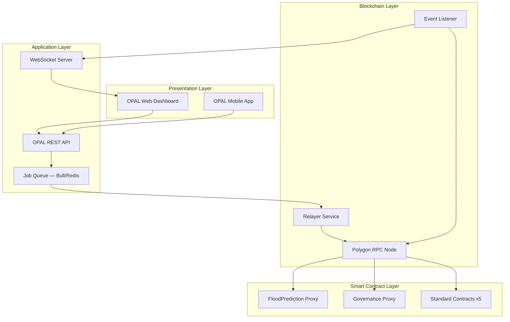
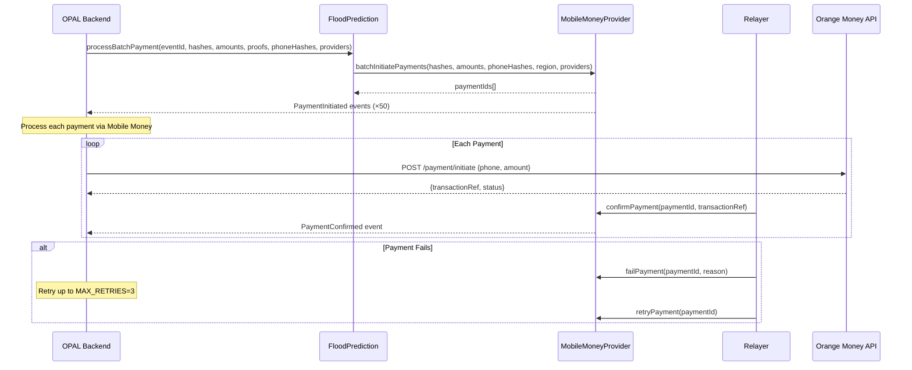
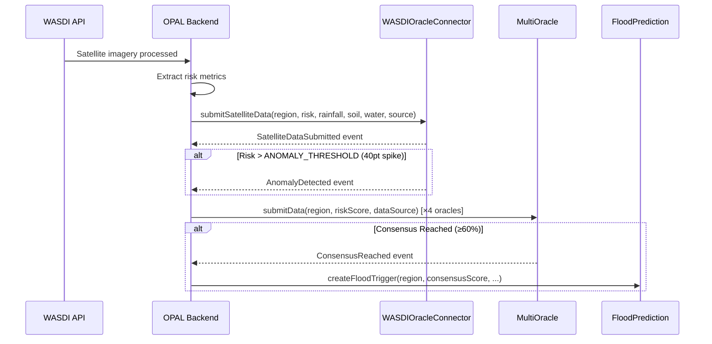
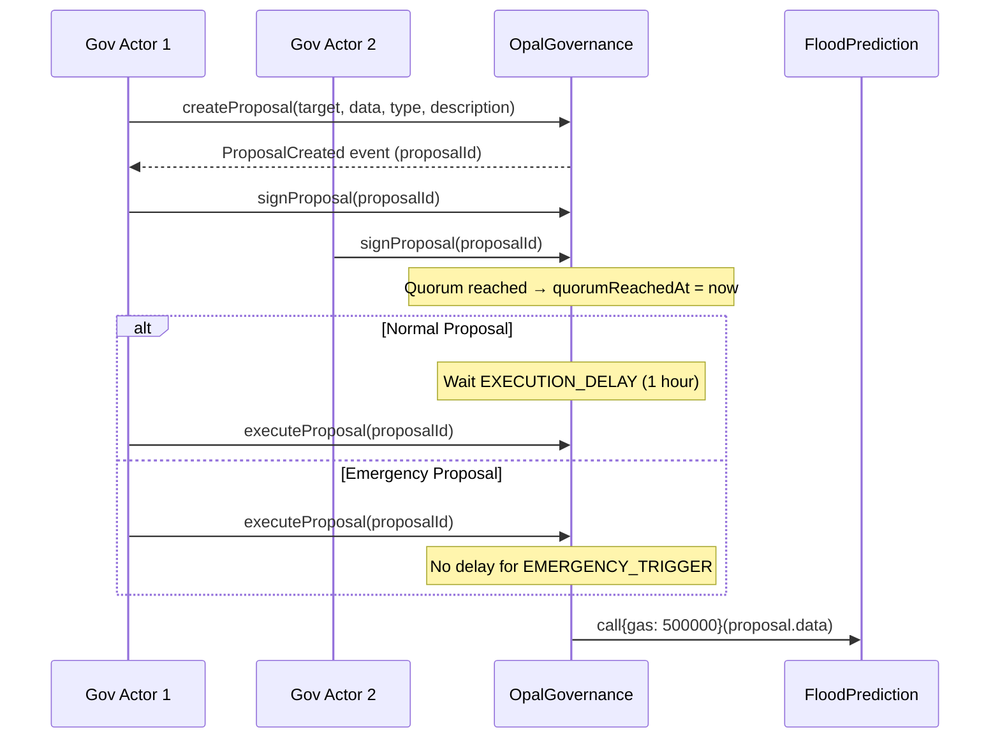
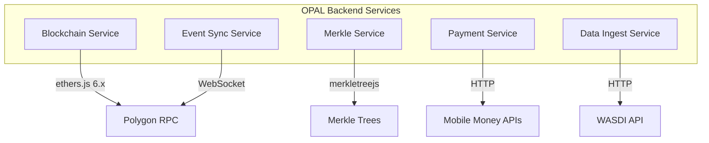
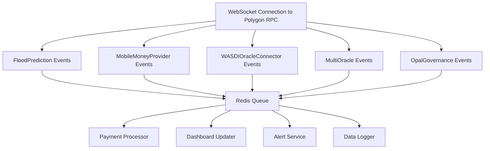
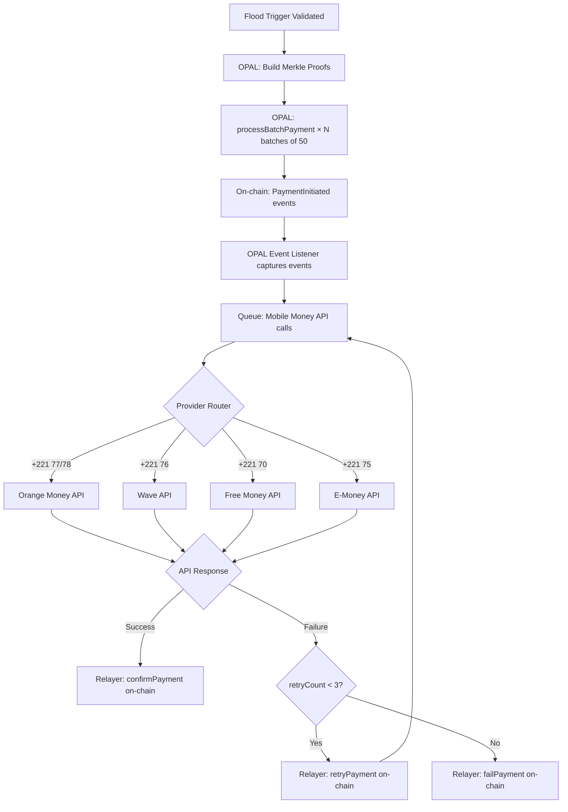
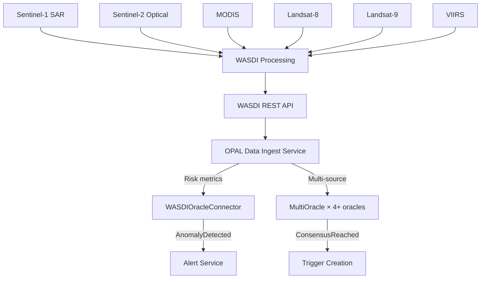
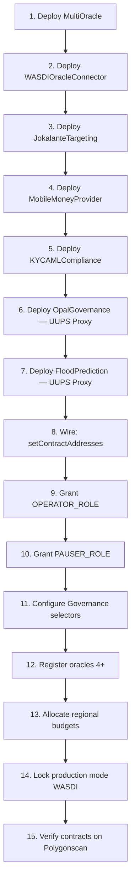
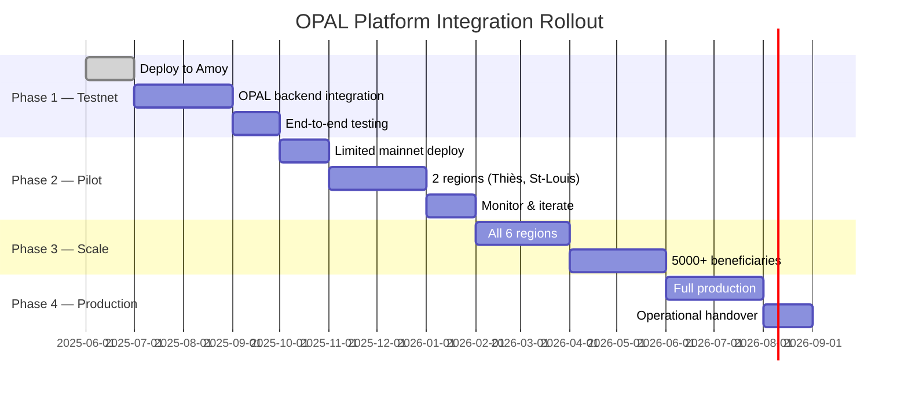

# Integration Plan with OPAL Platform

**Project**: OPAL Platform — DPA Foundation  
**Version**: 1.0.0  
**Status**: Testnet-Ready (Polygon Amoy)

---

## Table of Contents

1. [Executive Summary](#1-executive-summary)
2. [Integration Architecture](#2-integration-architecture)
3. [Contract Integration Points](#3-contract-integration-points)
4. [OPAL Backend Integration](#4-opal-backend-integration)
5. [Event-Driven Architecture](#5-event-driven-architecture)
6. [Mobile Money Integration](#6-mobile-money-integration)
7. [WASDI Satellite Data Pipeline](#7-wasdi-satellite-data-pipeline)
8. [Deployment & Configuration](#8-deployment--configuration)
9. [Integration Testing Strategy](#9-integration-testing-strategy)
10. [Rollout Plan](#10-rollout-plan)

---

## 1. Executive Summary

This document details the integration plan between the OPAL web platform and the blockchain smart contract layer deployed on Polygon PoS. The integration follows an **event-driven relayer architecture** where the OPAL backend acts as the bridge between off-chain systems (WASDI satellite feeds, Mobile Money APIs, beneficiary databases) and on-chain smart contracts.

### Key Integration Principles

1. **Relayer Pattern** — OPAL backend submits transactions via designated relayer wallets
2. **Event Monitoring** — On-chain events drive off-chain workflow updates
3. **Hash-Only On-Chain** — Personal data remains off-chain; only keccak256 hashes go on-chain
4. **Merkle Proofs** — Beneficiary lists compressed to single root hash; proofs generated per payment
5. **Idempotent Operations** — Resumable deployment, duplicate payment prevention, nonce-based IDs

### System Boundary

```mermaid
graph LR
    subgraph Off-Chain
        OPAL[OPAL Platform]
        WASDI[WASDI API]
        MM[Mobile Money APIs]
        DB[(PostgreSQL)]
    end
    
    subgraph On-Chain — Polygon PoS
        FPC[FloodPredictionContract]
        MO[MultiOracle]
        GOV[OpalGovernance]
        JKT[JokalanteTargeting]
        MMP[MobileMoneyProvider]
        KYC[KYCAMLCompliance]
        WASDI_C[WASDIOracleConnector]
    end
    
    OPAL -->|Relayer TX| FPC
    OPAL -->|Event Listener| FPC
    OPAL -->|Data Feed| WASDI_C
    OPAL <-->|Payment Bridge| MMP
    WASDI -->|Satellite Data| OPAL
    MM <-->|Payment APIs| OPAL
    DB <-->|State Sync| OPAL
```

---

## 2. Integration Architecture

### 2.1 Layered Architecture



### 2.2 Component Responsibilities

| Component | Responsibility |
|-----------|---------------|
| **OPAL REST API** | User management, beneficiary CRUD, trigger initiation, budget management |
| **Relayer Service** | Signs and submits transactions to Polygon via designated wallets |
| **Event Listener** | Monitors contract events via WebSocket/polling, updates OPAL database |
| **Job Queue** | Asynchronous processing of batch payments, data feeds, confirmations |
| **Merkle Service** | Generates Merkle trees from beneficiary lists, provides proofs |

### 2.3 Wallet Architecture

| Wallet | Role | Contract Permissions |
|--------|------|---------------------|
| Admin Wallet | ADMIN_ROLE on FPC, Owner on standard contracts | Budget allocation, emergency control, configuration |
| Operator Wallet | OPERATOR_ROLE on FPC | Trigger creation, payment processing |
| Pauser Wallet | PAUSER_ROLE on FPC | Emergency pause/unpause |
| Relayer Wallet | Relayer on MMP + WASDI | Payment confirmation, satellite data submission |
| Oracle Wallets (4+) | Registered oracles on MultiOracle | Multi-oracle data submission |

---

## 3. Contract Integration Points

### 3.1 FloodPredictionContract (UUPS Proxy)

Primary integration target — all flood operations route through this contract.

#### Write Operations

| Operation | Function | Parameters | OPAL Trigger |
|-----------|----------|------------|-------------|
| Create Flood Trigger | `createFloodTrigger` | region, riskScore, merkleRoot, totalAmount, beneficiaryCount | WASDI alert + risk threshold |
| Validate Trigger | `validateTrigger` | eventId | Manual operator approval |
| Batch Payment | `processBatchPayment` | eventId, hashes[], amounts[], proofs[][], phoneHashes[] | Post-validation auto-process |
| Validate + Pay | `validateAndProcessPayments` | Same as batch payment | Combined flow |
| Allocate Budget | `allocateBudget` | region, amount | Admin budget allocation |
| Cancel Trigger | `cancelTrigger` | eventId, reason | Admin decision (ADMIN_ROLE required) |
| Gov Override | `createGovernanceOverrideTrigger` | region, riskScore, merkleRoot, totalAmount, beneficiaryCount, reason | Governance vote |

#### Read Operations

| Operation | Function | Use Case |
|-----------|----------|----------|
| Get Trigger | `getFloodTrigger(eventId)` | Dashboard display |
| Region Budget | `getRegionBudgetRemaining(region)` | Budget monitoring |
| Payment Status | `isBeneficiaryPaid(eventId, hash)` | Payment verification |
| Cooldown | `getCooldownRemaining(region, riskScore)` | Trigger availability |
| System Stats | `getSystemStats()` | Admin dashboard |
| Paginated Triggers | `getTriggerIdsPaginated(offset, limit)` | Trigger listing |

### 3.2 MobileMoneyProvider

Payment bridge between on-chain records and off-chain Mobile Money APIs.

#### Integration Flow



#### Provider Configuration

| Provider | Prefix | Phone Format |
|----------|--------|-------------|
| Orange Money | +221 77, +221 78 | +221 77XXXXXXX |
| Wave | +221 76 | +221 76XXXXXXX |
| Free Money | +221 70 | +221 70XXXXXXX |
| E-Money | +221 75 | +221 75XXXXXXX |

### 3.3 WASDIOracleConnector

Satellite data ingestion from WASDI Earth Observation platform.

#### Data Flow



#### Satellite Sources

| Source | Type | Resolution |
|--------|------|-----------|
| Sentinel-1 | SAR (Synthetic Aperture Radar) | 10m |
| Sentinel-2 | Optical/Multispectral | 10m |
| MODIS | Moderate Resolution | 250m |
| Landsat-8 | Optical/Thermal | 30m |
| Landsat-9 | Optical/Thermal | 30m |
| VIIRS | Visible Infrared Imaging | 375m |

#### Data Validation Bounds

| Parameter | Max Value | Unit |
|-----------|----------|------|
| Risk Score | 100 | — |
| Rainfall | 2,000 | mm/24h |
| Soil Moisture | 100 | % |
| Water Level | 10,000 | cm |

### 3.4 OpalGovernanceUpgradeable

Sign-based governance for administrative actions.

#### Governance Flow



#### Whitelisted Selectors

| Function | Selector | Purpose |
|----------|----------|---------|
| `createGovernanceOverrideTrigger` | Computed | Override risk threshold for trigger creation |
| `pause` | Computed | Emergency pause via governance |
| `unpause` | Computed | Resume operations via governance |

---

## 4. OPAL Backend Integration

### 4.1 Required Backend Services



### 4.2 Blockchain Service

**Technology**: ethers.js v6 (matching contract development stack)

**Key dependencies** (same as smart contract project):
```json
{
  "ethers": "^6.14.0",
  "merkletreejs": "^0.6.0",
  "keccak256": "^1.0.6"
}
```

**Contract instantiation pattern:**
```javascript
import { ethers } from 'ethers';

// Connect to Polygon PoS
const provider = new ethers.JsonRpcProvider(process.env.POLYGON_RPC_URL);
const wallet = new ethers.Wallet(process.env.OPERATOR_PRIVATE_KEY, provider);

// Load contract ABI from deployment artifacts
const floodPrediction = new ethers.Contract(
  deploymentManifest.contracts.FloodPredictionProxy,
  FloodPredictionABI,
  wallet
);
```

### 4.3 Merkle Service

**Purpose**: Generate Merkle trees from beneficiary lists for each flood trigger.

**Flow:**
1. OPAL queries beneficiary database for eligible recipients in a region
2. For each beneficiary: `leaf = keccak256(bytes.concat(keccak256(abi.encode(beneficiaryHash, amount))))` (double-hash)
3. Build Merkle tree using `merkletreejs` with `keccak256` hash function and sorted pairs
4. Store `merkleRoot` on-chain via `createFloodTrigger`
5. Generate individual proofs for each beneficiary during `processBatchPayment`

**Critical**: Leaf encoding uses `abi.encode` (NOT `abi.encodePacked`) — matches contract H-11 fix.

```javascript
import { MerkleTree } from 'merkletreejs';
import keccak256 from 'keccak256';
import { ethers } from 'ethers';

// Generate leaves using double-hash (matching Solidity H-07 fix)
const leaves = beneficiaries.map(b => {
  const innerHash = keccak256(ethers.AbiCoder.defaultAbiCoder().encode(
    ['bytes32', 'uint256'], 
    [b.hash, b.amount]
  ));
  return keccak256(innerHash); // double-hash: keccak256(bytes.concat(keccak256(...)))
});

const tree = new MerkleTree(leaves, keccak256, { sortPairs: true });
const root = tree.getHexRoot();

// Per-beneficiary proof for payment
const proof = tree.getHexProof(leaves[index]);
```

### 4.4 Deployment Artifacts

The deployment scripts generate JSON manifests used by the OPAL backend:

```json
{
  "network": "polygon",
  "chainId": 137,
  "deployer": "0x...",
  "timestamp": "2025-06-...",
  "contracts": {
    "MultiOracle": "0x...",
    "WASDIOracleConnector": "0x...",
    "JokalanteTargeting": "0x...",
    "MobileMoneyProvider": "0x...",
    "KYCAMLCompliance": "0x...",
    "OpalGovernanceProxy": "0x...",
    "OpalGovernanceImpl": "0x...",
    "FloodPredictionProxy": "0x...",
    "FloodPredictionImpl": "0x..."
  }
}
```

---

## 5. Event-Driven Architecture

### 5.1 Critical Events to Monitor

| Contract | Event | OPAL Action |
|----------|-------|-------------|
| FloodPrediction | `FloodTriggerCreated` | Update dashboard, notify operators |
| FloodPrediction | `TriggerValidated` | Initiate batch payment queue |
| FloodPrediction | `BatchPaymentProcessed` | Update payment records, notify |
| FloodPrediction | `EmergencyModeActivated` | Alert admin, update UI |
| FloodPrediction | `BudgetAllocated` | Update budget dashboard |
| MobileMoneyProvider | `PaymentInitiated` | Queue Mobile Money API call |
| MobileMoneyProvider | `PaymentConfirmed` | Update beneficiary record |
| MobileMoneyProvider | `PaymentFailed` | Queue retry or alert |
| MobileMoneyProvider | `PaymentExpired` | Mark expired, alert |
| WASDIOracleConnector | `SatelliteDataSubmitted` | Log data point |
| WASDIOracleConnector | `AnomalyDetected` | Alert — potential flood event |
| WASDIOracleConnector | `HighRiskDetected` | Trigger creation workflow |
| MultiOracle | `ConsensusReached` | Validated risk score, can create trigger |
| OpalGovernance | `ProposalCreated` | Notify governance actors |
| OpalGovernance | `ProposalExecuted` | Execute pending action |
| KYCAMLCompliance | `BeneficiarySuspended` | Block from future payments |

### 5.2 Event Listener Architecture



### 5.3 Event Indexing

For historical queries, OPAL should maintain an event index in PostgreSQL:

| Table | Fields | Source Event |
|-------|--------|-------------|
| `flood_triggers` | eventId, region, riskScore, status, timestamp | FloodTriggerCreated, TriggerValidated |
| `payments` | paymentId, beneficiaryHash, amount, status, txHash | PaymentInitiated, Confirmed, Failed |
| `satellite_data` | region, riskScore, rainfall, source, timestamp | SatelliteDataSubmitted |
| `governance_proposals` | proposalId, type, status, signatures | ProposalCreated, Executed |
| `budget_allocations` | region, amount, allocatedBy, timestamp | BudgetAllocated |

---

## 6. Mobile Money Integration

### 6.1 Payment Flow (End-to-End)



### 6.2 Mobile Money API Integration Points

| Provider | Sandbox URL | Production URL | Auth Method |
|----------|------------|----------------|-------------|
| Orange Money | sandbox.orangemoney.sn | api.orangemoney.sn | OAuth2 + API Key |
| Wave | sandbox.wave.com | api.wave.com | API Key |
| Free Money | sandbox.freemoney.sn | api.freemoney.sn | API Key |
| E-Money | sandbox.emoney.sn | api.emoney.sn | API Key |

### 6.3 Payment Reconciliation

OPAL must reconcile on-chain payment records with Mobile Money transaction refs:

1. **On-chain**: `PaymentConfirmed(paymentId, transactionRef)` — recorded permanently
2. **Off-chain**: Mobile Money API confirmation — stored in OPAL database
3. **Reconciliation job**: Compare daily — flag mismatches for manual review

---

## 7. WASDI Satellite Data Pipeline

### 7.1 Data Ingestion Flow



### 7.2 Data Processing Pipeline

| Step | System | Action |
|------|--------|--------|
| 1. Acquisition | WASDI | Download satellite imagery for Senegal flood zones |
| 2. Processing | WASDI | Compute flood indicators (NDWI, SAR backscatter, etc.) |
| 3. Risk Scoring | OPAL | Convert indicators to 0-100 risk score |
| 4. On-Chain Submission | WASDIOracleConnector | Store satellite data on-chain |
| 5. Multi-Oracle Consensus | MultiOracle | 4+ independent oracle submissions |
| 6. Consensus Check | MultiOracle | IQR outlier filtering + 60% threshold |
| 7. Trigger Decision | OPAL/FPC | Create flood trigger if consensus score ≥ risk threshold |

### 7.3 Freshness Requirements

| Parameter | Value | Implication |
|-----------|-------|-------------|
| DATA_FRESHNESS | 6 hours | Data older than 6h returns risk score = 0 |
| MIN_FRESHNESS | 30 minutes | Cannot set freshness below 30 min |
| MAX_FRESHNESS | 7 days | Cannot set freshness above 7 days |
| Polling Interval | 1 hour (recommended) | OPAL should poll WASDI hourly |

---

## 8. Deployment & Configuration

### 8.1 Deployment Sequence



### 8.2 Pre-Configured Regions (Senegal)

| Code | Region | Initial Budget (CFA) |
|------|--------|---------------------|
| SN-TH | Thiès | 1,000,000 |
| SN-DK | Dakar | 2,000,000 |
| SN-SL | Saint-Louis | 1,500,000 |
| SN-ZG | Ziguinchor | 1,200,000 |
| SN-KL | Kaolack | 800,000 |
| SN-TC | Tambacounda | 600,000 |

### 8.3 Network Configuration

| Network | Chain ID | RPC | Explorer |
|---------|----------|-----|----------|
| Polygon PoS (mainnet) | 137 | polygon-mainnet.infura.io | polygonscan.com |
| Polygon Amoy (testnet) | 80002 | polygon-amoy.infura.io | amoy.polygonscan.com |
| Sepolia (testnet) | 11155111 | sepolia.infura.io | sepolia.etherscan.io |
| Localhost (dev) | 31337 | http://localhost:8545 | — |

### 8.4 Environment Variables

```bash
# Network
POLYGON_RPC_URL=https://polygon-mainnet.infura.io/v3/<KEY>
AMOY_RPC_URL=https://polygon-amoy.infura.io/v3/<KEY>

# Wallets (NEVER commit to source control)
ADMIN_PRIVATE_KEY=0x...
OPERATOR_PRIVATE_KEY=0x...
RELAYER_PRIVATE_KEY=0x...

# Contract Addresses (from deployment manifest)
FLOOD_PREDICTION_PROXY=0x...
MOBILE_MONEY_PROVIDER=0x...
MULTI_ORACLE=0x...

# External APIs
WASDI_API_URL=https://wasdi.net/api/v1
WASDI_API_KEY=...
ORANGE_MONEY_API_URL=https://api.orangemoney.sn/v1
ORANGE_MONEY_API_KEY=...

# Polygonscan
POLYGONSCAN_API_KEY=...
```

---

## 9. Integration Testing Strategy

### 9.1 Test Environments

| Environment | Network | Purpose |
|-------------|---------|---------|
| Unit Tests | Hardhat EDR (local) | Contract logic — 339 tests |
| Integration Tests | Hardhat localhost | End-to-end contract interaction |
| Testnet Tests | Polygon Amoy | Real network conditions, gas costs |
| Staging | Polygon Amoy + Mock APIs | Full OPAL + blockchain integration |
| Production | Polygon PoS | Live deployment |

### 9.2 Integration Test Scenarios

| # | Scenario | Components | Expected Result |
|---|----------|-----------|----------------|
| 1 | Full trigger lifecycle | WASDI → Oracle → FPC → MMP | Trigger created, payments processed |
| 2 | Batch payment (1000 beneficiaries) | FPC → MMP → Mobile Money | 20 batches processed, all confirmed |
| 3 | Governance override | GOV → FPC | Override trigger created via proposal |
| 4 | Emergency pause | Admin → FPC | All operations blocked, unpause resumes |
| 5 | Oracle consensus | 4 oracles → MO → FPC | Consensus reached, trigger auto-created |
| 6 | Payment failure + retry | MMP → Mobile Money (fail) → retry | 3 retries, then permanent failure |
| 7 | Duplicate payment prevention | FPC (same beneficiary twice) | Second attempt reverts |
| 8 | Budget exhaustion | FPC with low budget | InsufficientBudget revert |
| 9 | KYC blocked beneficiary | KYC (suspended) → FPC payment | KYCCheckFailed revert |
| 10 | UUPS upgrade | UPGRADER → new impl | State preserved, new logic active |

### 9.3 Stress Test Benchmarks (Validated)

From stress-test-1000.js methodology:

| Phase | Operations | Target Throughput |
|-------|-----------|-------------------|
| Trigger Creation | 200 across 5 regions | With cooldown handling |
| Batch Payments | 20 × 50 = 1,000 | Sequential batches |
| Budget Operations | 500 allocations | Continuous |
| View Functions | 300 queries | Non-blocking |

---

## 10. Rollout Plan

### 10.1 Phases



### 10.2 Phase 1 — Testnet Integration

| Task | Status | Notes |
|------|--------|-------|
| Smart contracts deployed to Amoy | ✅ Ready | Resumable deploy script available |
| 339/339 tests passing | ✅ Complete | Full regression suite |
| Deployment manifest generated | ✅ Ready | deploy-amoy.js produces JSON |
| OPAL backend blockchain service | Pending | ethers.js v6 integration |
| Event listener service | Pending | WebSocket to Amoy RPC |
| Merkle service | Pending | merkletreejs + keccak256 |
| Mock Mobile Money bridge | Pending | Sandbox API integration |

### 10.3 Phase 2 — Pilot Deployment

| Task | Details |
|------|---------|
| Mainnet deployment | Polygon PoS (chain 137) |
| Initial regions | Thiès (SN-TH), Saint-Louis (SN-SL) |
| Beneficiary scale | 500-1,000 per region |
| Mobile Money provider | Orange Money (primary) |
| Oracle setup | 4+ independent data sources |
| Governance actors | 3-5 DPA Foundation members |
| Production lock | WASDIOracleConnector.lockProductionMode() |

### 10.4 Success Criteria

| Metric | Target | Measurement |
|--------|--------|-------------|
| Trigger-to-payment latency | < 30 minutes | Time from trigger creation to first payment confirmation |
| Payment success rate | > 95% | Confirmed payments / initiated payments |
| Oracle consensus reliability | > 99% | Consensus reached / data submitted |
| System uptime | > 99.5% | OPAL backend + blockchain availability |
| Gas cost per beneficiary | < $0.02 | On Polygon PoS at standard gas prices |
| Beneficiary processing capacity | 5,000+ per event | Validated in scale tests |

---

*Integration Plan — OPAL Platform v4.0.0 — Avril 2026*
