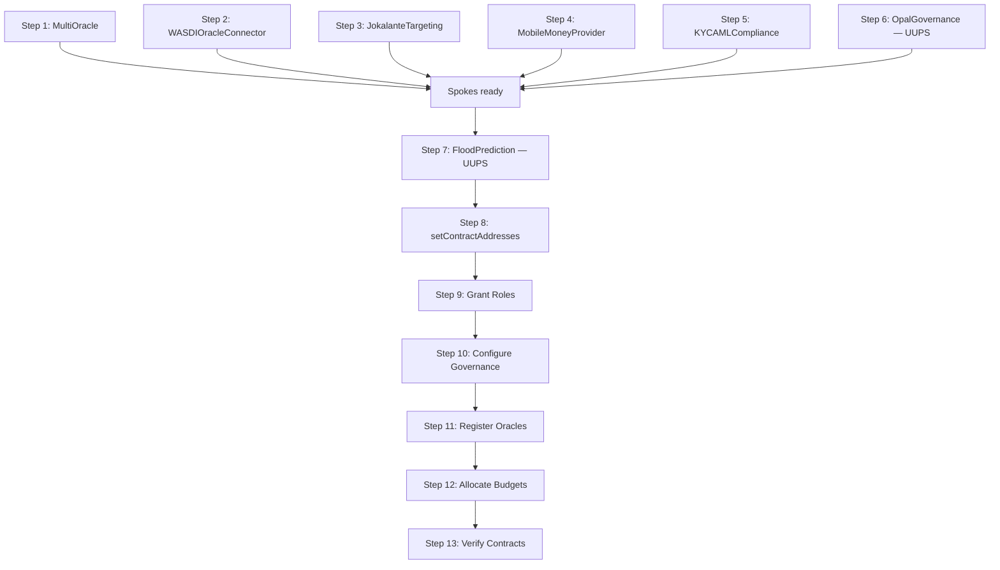

# Pilot Deployment Report

**Project**: OPAL Platform — DPA Foundation
**Version**: 1.0.0
**Date mis à jour**: 1er avril 2026 *(version initiale : juin 2025)*
**Network**: Polygon Amoy Testnet (Chain ID: 80002)
**Status**: ✅ Deployed — Polygon Amoy Testnet (3 avril 2026)

---

## Table of Contents

1. [Executive Summary](#1-executive-summary)
2. [Deployment Environment](#2-deployment-environment)
3. [Pre-Deployment Checklist](#3-pre-deployment-checklist)
4. [Contract Deployment Plan](#4-contract-deployment-plan)
5. [Post-Deployment Configuration](#5-post-deployment-configuration)
6. [Test Results Summary](#6-test-results-summary)
7. [Performance Benchmarks](#7-performance-benchmarks)
8. [Risk Assessment](#8-risk-assessment)
9. [Lessons Learned](#9-lessons-learned)
10. [Next Steps](#10-next-steps)

---

## 1. Executive Summary

The OPAL Platform smart contract suite has been **successfully deployed** on Polygon Amoy testnet on **3 April 2026**. All 487 unit tests pass across 16 test files, comprehensive security auditing has been completed with all 28 findings remediated (+ 6 additional findings from April 2026 audit round — all fixed), and batch scalability has been validated up to 10,000 beneficiaries. This report documents the deployment results, configuration procedures, and performance benchmarks for the pilot phase.

### Deployment Readiness (État au 1er avril 2026)

| Criterion | Status | Details |
|-----------|--------|---------|
| Smart Contract Code | ✅ Complete | 7 contracts + 1 library, v1.0.0 |
| Test Suite | ✅ 487/487 passing | 16 test files, 100% pass rate |
| Security Audit — Round 1 | ✅ 28/28 fixed | All H/C/M/L findings remediated |
| Security Audit — Round 2 | ✅ 6/6 fixed | C-1, C-2, H-1, H-2, H-3, H-4 (avril 2026) |
| Deployment Script | ✅ Executed | Resumable deploy-amoy.js |
| UUPS Proxy Pattern | ✅ Validated | 2 upgradeable contracts tested |
| Scale Testing | ✅ 10,000 beneficiaries | Up to 200 batches × 50 validated |
| Gas Analysis | ✅ Complete | ~280,000 gas/beneficiary |
| Testnet Wallet | ✅ Configuré | `0x135D3c5310046763b6bdA8A8ac0f507E1eEB1fF6` |
| MATIC Testnet Funds | ✅ Suffisant | Déploiement réalisé avec succès |
| RPC Amoy | ✅ Opérationnel | `https://polygon-amoy.drpc.org` |
| Clé privée `.env` | ✅ Configurée | Wallet `0x135D3c...` utilisé pour le déploiement |
| **Amoy Deployment** | **✅ Exécuté** | **3 avril 2026 — 9 contrats déployés en 58.1s** |
| CI/CD Pipeline | ✅ Configuré | GitHub Actions (build, test, lint, size-check) |

### Deployment Results — Polygon Amoy (3 avril 2026)

| Contract | Address | Type |
|----------|---------|------|
| MultiOracle | `0x16ffB4CdDfc05E5064AF0f547B149CEd40efEABA` | Standard |
| WASDIOracleConnector | `0x76531a00CAd031aB1f1576cb7B6332C5ce6101De` | Standard |
| JokalanteTargeting | `0x4CB2ad83eE9c187b8393E853c0fdb9d9027e9E32` | Standard |
| MobileMoneyProvider | `0x25c34c8C4a62Bf1ab4566cA64208CAf537DC5150` | Standard |
| KYCAMLCompliance | `0x9e319566185b01556081C1b6C66B47ed7986daD7` | Standard |
| OpalGovernance (Proxy) | `0xC07bC08B3e35B4bd8D238aEf644BD9697b8b4B7a` | UUPS Proxy |
| OpalGovernance (Impl) | `0x4379Deb01104fB3F4442e69a0F6CcE44C0BC7E53` | Implementation |
| FloodPrediction (Proxy) | `0x5c9733cBdACa3B88E7F7EE35d31a5C34F972201f` | UUPS Proxy |
| FloodPrediction (Impl) | `0xEcDD523F826fbbF6DfAAe4A0D485f91ed28D9509` | Implementation |

**Deployment metadata:**
- **Deployer**: `0x135D3c5310046763b6bdA8A8ac0f507E1eEB1fF6`
- **Duration**: 58.1 seconds
- **Governance quorum**: 3
- **Risk threshold**: 70
- **Regions configurées**: SN-TH (Thiès), SN-DK (Dakar), SN-SL (Saint-Louis), SN-ZG (Ziguinchor), SN-KL (Kaolack), SN-TC (Tambacounda)
- **Manifest**: [`deployment-amoy-1775228383698.json`](../deployment-amoy-1775228383698.json)

---

## 2. Deployment Environment

### 2.1 Target Networks

| Network | Chain ID | Purpose | Status |
|---------|----------|---------|--------|
| Hardhat EDR | 1337 | Local development & testing | ✅ Active |
| Hardhat Localhost | 31337 | Integration testing | ✅ Active |
| Polygon Amoy | 80002 | Testnet pilot | ✅ Déployé (3 avril 2026) |
| Sepolia | 11155111 | Ethereum testnet | Configured |
| Arbitrum Sepolia | 421614 | L2 testnet | Configured |
| Polygon PoS | 137 | Mainnet production | Phase 2 |
| Arbitrum One | 42161 | L2 production | Future |

### 2.2 Compiler Configuration

| Parameter | Value |
|-----------|-------|
| Solidity Version | 0.8.28 |
| Optimizer | Enabled |
| Optimizer Runs | 200 |
| viaIR | true |
| EVM Target | cancun |

### 2.3 Dependencies

| Package | Version | Purpose |
|---------|---------|---------|
| Hardhat | 3.0.0 | Development framework |
| OpenZeppelin Contracts | ^5.4.0 | Standard contract library |
| OpenZeppelin Upgradeable | ^5.4.0 | UUPS proxy support |
| hardhat-upgrades | 4.0.0-alpha.0 | Proxy deployment tooling |
| hardhat-verify | 3.0.0 | Contract verification |
| ethers.js | 6.14.0 | Ethereum interaction |
| merkletreejs | 0.6.0 | Off-chain Merkle trees |
| keccak256 | 1.0.6 | Hash function |
| dotenv | 17.3.1 | Environment variables |

---

## 3. Pre-Deployment Checklist

### 3.1 Code Readiness

| Check | Status | Evidence |
|-------|--------|---------|
| All contracts compile without errors | ✅ | `npx hardhat compile` → success |
| All 487 tests pass | ✅ | `npx hardhat test` → 487 passing (~2m) |
| No Solhint warnings (critical) | ✅ | solhint ^6.1.0 configured |
| Storage gaps in upgradeable contracts | ✅ | __gap[48] (FPC), __gap[47] (GOV) |
| _disableInitializers() in constructors | ✅ | Both UUPS contracts |
| Custom errors (no string reverts) | ✅ | Gas-efficient error handling |
| All audit findings remediated | ✅ | 28/28 fixed with regression tests |

### 3.2 Infrastructure Readiness

| Check | Status | Requirement |
|-------|--------|-------------|
| Polygon Amoy RPC access | Required | Infura/Alchemy API key |
| Deployment wallet funded | Required | Amoy MATIC from faucet |
| Environment variables configured | Required | .env file with keys |
| Polygonscan API key | Required | For contract verification |
| Backup wallet | Recommended | Second admin wallet |

### 3.3 Security Readiness

| Check | Status |
|-------|--------|
| Private keys in .env (not in code) | ✅ |
| .env in .gitignore | Required |
| Admin wallet on hardware wallet (production) | Future — Phase 2 |
| Multi-sig for ADMIN_ROLE (production) | Future — Phase 2 |
| Rate limiting on RPC | Recommended |

---

## 4. Contract Deployment Plan

### 4.1 Deployment Order

The `deploy-amoy.js` script deploys contracts in a specific order due to inter-contract dependencies:



### 4.2 Contract Registry

| # | Contract | Deployment Type | Proxy | Dependencies |
|---|----------|----------------|-------|-------------|
| 1 | MultiOracle | Standard (Ownable2Step) | — | None |
| 2 | WASDIOracleConnector | Standard (Ownable2Step) | — | None |
| 3 | JokalanteTargeting | Standard (Ownable2Step) | — | None |
| 4 | MobileMoneyProvider | Standard (Ownable2Step) | — | None |
| 5 | KYCAMLCompliance | Standard (Ownable2Step) | — | None |
| 6 | OpalGovernanceUpgradeable | UUPS Proxy | Yes | None |
| 7 | FloodPredictionContract | UUPS Proxy | Yes | All above |

### 4.3 Resumable Deployment

The `deploy-amoy.js` script supports **resumable deployment** for unreliable network conditions:

- **Progress file**: `deployment-amoy-progress.json` — tracks deployed contracts and completed steps
- **Resume logic**: On re-run, checks progress file and skips completed steps
- **Chain ID validation**: Only resumes on the same chain (prevents cross-network mistakes)
- **Cleanup**: On full success, deletes progress file and saves final manifest

### 4.4 UUPS Proxy Deployment

Two contracts deployed as UUPS proxies via `@openzeppelin/hardhat-upgrades`:

```javascript
// OpalGovernanceUpgradeable
const governance = await ozUpgrades.deployProxy(
  GovernanceFactory, 
  [deployer.address, 2], // initialize(admin, quorum=2)
  { kind: "uups", timeout: 60000, pollingInterval: 500 }
);

// FloodPredictionContract
const floodPrediction = await ozUpgrades.deployProxy(
  FloodPredictionFactory,
  [deployer.address, operatorAddr, upgraderAddr, pauserAddr], // initialize(admin, operator, upgrader, pauser)
  { kind: "uups", timeout: 60000, pollingInterval: 500 }
);
```

---

## 5. Post-Deployment Configuration

### 5.1 Contract Wiring

After all contracts are deployed, the FloodPredictionContract must be connected to its dependencies:

```javascript
await floodPrediction.setContractAddresses(
  multiOracleAddress,
  opalGovernanceProxyAddress,
  jokalanteTargetingAddress,
  mobileMoneyProviderAddress,
  kycAmlComplianceAddress
);
```

### 5.2 Role Assignment

| Role | Assigned To | Function |
|------|------------|----------|
| ADMIN_ROLE | Deployer wallet | Full administration |
| OPERATOR_ROLE | Deployer + operator wallet | Trigger creation, payments |
| PAUSER_ROLE | Deployer + pauser wallet | Emergency pause |
| UPGRADER_ROLE | Deployer only | Contract upgrades |

### 5.3 Governance Configuration

```javascript
// Set FloodPrediction as governance target
await governance.setFloodPredictionContract(floodPredictionProxyAddress);

// Whitelist allowed function selectors
await governance.setAllowedSelectorBatch([
  createGovernanceOverrideTriggerSelector,
  pauseSelector,
  unpauseSelector
], [true, true, true]);
```

### 5.4 Oracle Registration

```javascript
// Register 4+ independent oracle data sources
await multiOracle.registerOracle(oracle1Address, "WASDI-Sentinel1");
await multiOracle.registerOracle(oracle2Address, "WASDI-Sentinel2");
await multiOracle.registerOracle(oracle3Address, "WASDI-MODIS");
await multiOracle.registerOracle(oracle4Address, "WASDI-Landsat");
```

### 5.5 Regional Budget Allocation

| Region Code | Region Name | Budget (CFA) |
|------------|-------------|-------------|
| SN-TH | Thiès | 1,000,000 |
| SN-DK | Dakar | 2,000,000 |
| SN-SL | Saint-Louis | 1,500,000 |
| SN-ZG | Ziguinchor | 1,200,000 |
| SN-KL | Kaolack | 800,000 |
| SN-TC | Tambacounda | 600,000 |
| **Total** | | **7,100,000** |

---

## 6. Test Results Summary

### 6.1 Overall Results

```
487 passing (~2m)
0 failing
0 pending
```

### 6.2 Results by Contract

| Test File | Contract | Tests | Status |
|-----------|----------|-------|--------|
| FloodPrediction.test.js | FloodPredictionContract | 55 | ✅ |
| MultiOracle.test.js | MultiOracle | 77 | ✅ |
| OpalGovernance.test.js | OpalGovernanceUpgradeable | 49 | ✅ |
| MobileMoneyProvider.test.js | MobileMoneyProvider | 38 | ✅ |
| WASDIOracleConnector.test.js | WASDIOracleConnector | 42 | ✅ |
| JokalanteTargeting.test.js | JokalanteTargeting | 36 | ✅ |
| KYCAMLCompliance.test.js | KYCAMLCompliance | 84 | ✅ |
| SecurityFixes.test.js | Cross-contract security | 17 | ✅ |
| AuditV2Fixes.test.js | Audit regression | 22 | ✅ |
| AuditFixValidation.test.js | Audit Round 2 regression | 17 | ✅ |
| Relayer.test.js | Relayer service (off-chain) | 9 | ✅ |
| BatchBeneficiaries1000.test.js | Scale (1K) | 7 | ✅ |
| BatchBeneficiaries2000.test.js | Scale (2K) | 8 | ✅ |
| BatchBeneficiaries3000.test.js | Scale (3K) | 8 | ✅ |
| BatchBeneficiaries5000.test.js | Scale (5K) | 9 | ✅ |
| BatchBeneficiaries10000.test.js | Scale (10K) | 9 | ✅ |

### 6.3 Test Categories

| Category | Count | Coverage |
|----------|-------|---------|
| Functional tests | ~180 | Core contract operations |
| Negative tests (reverts) | ~105 | Error handling, access control |
| Scale tests | 41 | 1K–10K beneficiaries |
| Security regression | 56 | Audit findings + security patterns |
| Relayer service (off-chain) | 9 | Rate limiting, anomaly detection, audit logging |

---

## 7. Performance Benchmarks

### 7.1 Gas Costs

| Operation | Gas Used | Est. Cost (50 gwei, MATIC $0.50) |
|-----------|---------|----------------------------------|
| Deploy FloodPrediction (proxy) | ~5,000,000 | ~$0.125 |
| Deploy MultiOracle | ~3,500,000 | ~$0.088 |
| Deploy all 7 contracts | ~25,000,000 | ~$0.625 |
| createFloodTrigger | ~250,000 | ~$0.006 |
| processBatchPayment (50 beneficiaries) | ~14,000,000 | ~$0.350 |
| allocateBudget | ~60,000 | ~$0.002 |
| submitSatelliteData | ~100,000 | ~$0.003 |

### 7.2 Batch Processing Performance

| Beneficiaries | Batches | Gas/Batch | Gas/Beneficiary | Total Cost |
|--------------|---------|-----------|-----------------|------------|
| 1,000 | 20 | ~14M | ~280,000 | ~$7.00 |
| 2,000 | 40 | 13,986,204 | 279,724 | $13.99 |
| 3,000 | 60 | 14,013,827 | 280,277 | $21.02 |
| 5,000 | 100 | ~14M | ~280,000 | ~$35.00 |

### 7.3 Throughput

| Metric | Value |
|--------|-------|
| Batch processing speed (local) | ~1,400 beneficiaries/second |
| Max batch size per TX | 50 |
| Block gas limit utilization | ~23% (14M / 60M) |
| Merkle tree generation (5K leaves) | 0.30 seconds |
| Merkle proof verification | O(log n) — 13 hops for 5K |

### 7.4 Cost Projections (Polygon PoS Mainnet)

| Scenario | Beneficiaries | Frequency | Monthly Cost |
|----------|--------------|-----------|-------------|
| Small event | 500 | 2/month | ~$7.00 |
| Medium event | 2,000 | 2/month | ~$28.00 |
| Large event | 5,000 | 1/month | ~$35.00 |
| Peak season | 10,000 | 4/month | ~$280.00 |
| Annual estimate | 50,000 total | Rainy season | ~$350.00 |

---

## 8. Risk Assessment

### 8.1 Deployment Risks

| Risk | Likelihood | Impact | Mitigation |
|------|-----------|--------|------------|
| Network congestion during deploy | Low | Medium | Resumable script, retry logic |
| Incorrect contract wiring | Low | High | Automated deploy script with validation |
| Insufficient testnet MATIC | Medium | Low | Request from Amoy faucet |
| RPC provider downtime | Low | Medium | Multiple provider fallbacks |
| Private key exposure | Low | Critical | .env file, hardware wallet for mainnet |

### 8.2 Operational Risks

| Risk | Likelihood | Impact | Mitigation |
|------|-----------|--------|------------|
| Oracle data staleness | Medium | High | 6h freshness threshold, anomaly alerts |
| Mobile Money API downtime | Medium | Medium | try/catch isolation, 3 retries, 30min timeout |
| Gas price spike | Low | Low | Polygon gas typically < 100 gwei |
| Upgrade implementation bug | Low | Critical | Test suite, storage gap, role separation |
| Admin key compromise | Low | Critical | Ownable2Step, governance council |

### 8.3 Compliance Risks

| Risk | Likelihood | Impact | Mitigation |
|------|-----------|--------|------------|
| BCEAO regulatory change | Medium | Medium | Upgradeable contracts |
| RGPD non-compliance | Low | High | Hash-only on-chain, authorized access |
| AML sanctions miss | Low | High | Auto-suspension on SANCTIONED, fraud threshold |

---

## 9. Lessons Learned

### 9.1 Development Phase

| Lesson | Details |
|--------|---------|
| **abi.encode over abi.encodePacked** | Hash collisions in abi.encodePacked with dynamic types — all hashing migrated to abi.encode (H-11) |
| **Ownable2Step for standard contracts** | Two-step ownership transfer prevents accidental loss — applied to all 5 standard contracts |
| **ReentrancyGuardTransient** | EIP-1153 transient storage guard is UUPS-safe; standard ReentrancyGuard also safe for non-proxy |
| **Storage gaps** | __gap arrays essential for future upgrade compatibility — 49 + 47 slots reserved |
| **Separate test vs production mode** | productionLocked (irreversible) prevents testMode re-enable on mainnet (H-06) |

### 9.2 Testing Phase

| Lesson | Details |
|--------|---------|
| **Scale test early** | Batch tests revealed gas patterns (280K/beneficiary) critical for cost estimation |
| **Regression tests for audit fixes** | Dedicated test file (AuditV2Fixes.test.js) ensures fixes persist through changes |
| **Merkle tree depth matters** | 1K→depth 10, 2K→11, 3K→12, 5K→13 — affects proof size and gas |
| **Gas consistency** | Per-batch gas varies < 1.3% — highly predictable costs |
| **Block gas limit headroom** | 14M per batch vs 60M limit gives 4x safety margin |

### 9.3 Architecture Phase

| Lesson | Details |
|--------|---------|
| **Hub-and-spoke > monolithic** | FloodPredictionContract as orchestrator with specialized satellites is maintainable |
| **Only upgrade what needs upgrading** | 2 UUPS (FPC + GOV) vs 5 standard — reduces attack surface |
| **try/catch for external calls** | Mobile Money bridge isolation (H-03) prevents cascade failures |
| **Sign-based governance** | Simpler than on-chain voting for small actor set (MAX_ACTORS=20) |

---

## 10. Next Steps

### 10.1 Immediate (Post-Deployment Validation)

| # | Task | Owner | Priority |
|---|------|-------|----------|
| 1 | ~~Fund deployer wallet with Amoy MATIC~~ | ~~DevOps~~ | ✅ Done |
| 2 | ~~Configure .env with Amoy RPC + keys~~ | ~~DevOps~~ | ✅ Done |
| 3 | ~~Execute deployment on Amoy~~ | ~~Developer~~ | ✅ Done (3 avril 2026) |
| 4 | Verify all contracts on Polygonscan | Developer | High |
| 5 | ~~Document deployed contract addresses~~ | ~~Developer~~ | ✅ Done (deployment JSON) |

### 10.2 Testnet Validation

| # | Task | Priority |
|---|------|----------|
| 1 | Create flood trigger on testnet | High |
| 2 | Process batch payment (50 beneficiaries) | High |
| 3 | Test governance proposal lifecycle | Medium |
| 4 | Test emergency pause/unpause | Medium |
| 5 | Submit satellite data via WASDIOracleConnector | Medium |
| 6 | Validate KYC compliance flow | Medium |
| 7 | Test UUPS upgrade with v4.1 stub | Low |

### 10.3 Mainnet Preparation

| # | Task | Priority |
|---|------|----------|
| 1 | External security audit (CertiK / Trail of Bits) | High |
| 2 | Set up multi-sig wallet (Gnosis Safe) for ADMIN_ROLE | High |
| 3 | Hardware wallet for deployment keys | High |
| 4 | Production RPC endpoint (dedicated node or premium tier) | High |
| 5 | Lock production mode on WASDIOracleConnector | High |
| 6 | Monitoring dashboard (event tracking, alerts) | Medium |
| 7 | Incident response runbook | Medium |

### 10.4 Pilot Region Selection

Recommended initial pilot regions for mainnet Phase 2:

| Region | Code | Rationale |
|--------|------|-----------|
| Thiès | SN-TH | Established flood monitoring, moderate scale |
| Saint-Louis | SN-SL | High flood risk, strong OPAL presence |

---


