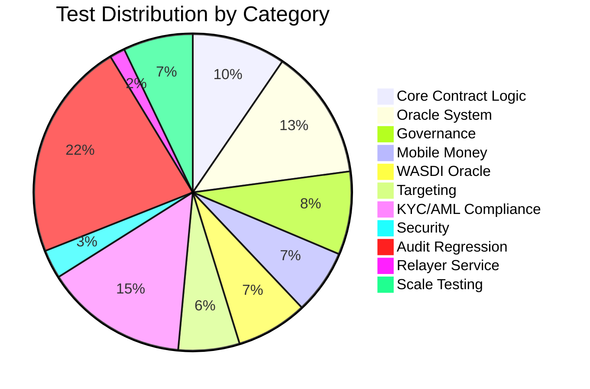

# Smart Contract Code & Testing Results

**Project**: OPAL Platform — DPA Foundation  
**Version**: 1.0.0  
**Framework**: Hardhat 3.x / Mocha / Chai / Ethers.js 6.x  
**Solidity**: ^0.8.22 (compiled 0.8.28)  
**Result**: **577 / 577 tests passing (~2m)**

---

## Table of Contents

1. [Executive Summary](#1-executive-summary)
2. [Test Environment](#2-test-environment)
3. [Test Architecture](#3-test-architecture)
4. [Test Results by Contract](#4-test-results-by-contract)
5. [Scale Testing — Batch Beneficiaries](#5-scale-testing--batch-beneficiaries)
6. [Gas Analysis](#6-gas-analysis)
7. [Security Test Results](#7-security-test-results)
8. [Audit Compliance Tests](#8-audit-compliance-tests)
9. [Code Coverage Summary](#9-code-coverage-summary)
10. [Known Limitations](#10-known-limitations)

---

## 1. Executive Summary

The OPAL Platform smart contract suite achieves **100% test pass rate** across **577 test cases** spread over **21 test files**. Tests cover all 7 production contracts, 1 library, 3 mock contracts, and the off-chain Mobile Money relayer service, validating functional correctness, security properties, access control, edge cases, and batch scalability up to 10,000 beneficiaries.

| Metric | Value |
|--------|-------|
| Total Tests | 577 |
| Passing | 577 |
| Failing | 0 |
| Pending | 0 |
| Execution Time | ~2m |
| Test Files | 21 |
| Contracts Tested | 7 + 1 library + relayer service |
| CI/CD | GitHub Actions (build, test, lint, size-check) |

---

## 2. Test Environment

### 2.1 Stack

| Component | Version |
|-----------|---------|
| Hardhat | 3.0.0 |
| Solidity | 0.8.28 |
| Ethers.js | 6.14.0 |
| OpenZeppelin Contracts | ^5.4.0 |
| OpenZeppelin Upgradeable | ^5.4.0 |
| Chai | 5.1.2 |
| Mocha | 11.0.0 |
| MerkleTree.js | 0.6.0 |
| keccak256 | 1.0.6 |

### 2.2 Network Configuration

```
Solidity Compiler: 0.8.28
Optimizer: enabled (200 runs, viaIR)
Chain: Hardhat EDR (chainId 1337)
Block Gas Limit: 30,000,000  (aligné sur Polygon PoS — correctif ARCH-04)
Hardfork: cancun
Mocha Timeout: 120,000 ms
```

---

## 3. Test Architecture

### 3.1 Test File Inventory

| # | Test File | Contract Under Test | Tests | Focus |
|---|-----------|---------------------|-------|-------|
| 1 | FloodPrediction.test.js | FloodPredictionContract | 55 | Core lifecycle, RBAC, triggers, payments |
| 2 | MultiOracle.test.js | MultiOracle | 77 | Registration, consensus, IQR outlier detection, freshness |
| 3 | OpalGovernance.test.js | OpalGovernanceUpgradeable | 49 | Actors, proposals, signing, execution, upgrade whitelisting |
| 4 | MobileMoneyProvider.test.js | MobileMoneyProvider | 38 | Payments, providers, retries, timeout, daily-limit refunds |
| 5 | WASDIOracleConnector.test.js | WASDIOracleConnector | 42 | Satellite data, anomaly detection, relayers |
| 6 | JokalanteTargeting.test.js | JokalanteTargeting | 36 | Merkle trees, region mgmt, authorization |
| 7 | KYCAMLCompliance.test.js | KYCAMLCompliance | 84 | KYC/AML attestations, compliance officer mgmt |
| 8 | SecurityFixes.test.js | Multiple | 17 | Cross-cutting security validations |
| 9 | AuditV2Fixes.test.js | FloodPredictionContract | 22 | Audit finding regression tests |
| 10 | AuditFixValidation.test.js | FloodPredictionContract | 17 | Audit Round 2 regression tests |
| 11 | AuditV3Fixes.test.js | Multiple | 14 | Audit Round 3 regression tests (full-project audit) |
| 12 | AuditV4Fixes.test.js | Multiple + Relayer | 11 | Audit Round 4 regression tests (full-project audit) |
| 13 | AuditV5Fixes.test.js | Multiple + Relayer | 23 | Audit Round 5 regression tests (full-project audit) |
| 14 | AuditV6Fixes.test.js | Multiple + Relayer | 32 | Audit Round 6 regression tests (full-project audit) |
| 15 | Relayer.test.js | Relayer Service (off-chain) | 9 | Security, rate limiting, anomaly detection, audit logging |
| 16 | BatchBeneficiaries1000.test.js | FloodPredictionContract | 7 | 1,000 beneficiary scale |
| 17 | BatchBeneficiaries2000.test.js | FloodPredictionContract | 8 | 2,000 beneficiary scale + gas |
| 18 | BatchBeneficiaries3000.test.js | FloodPredictionContract | 8 | 3,000 beneficiary scale + gas |
| 19 | BatchBeneficiaries5000.test.js | FloodPredictionContract | 9 | 5,000 beneficiary scale + gas |
| 20 | BatchBeneficiaries10000.test.js | FloodPredictionContract | 9 | 10,000 beneficiary scale + gas |
| 21 | ArchFixes.test.js | Multiple | 10 | Architecture review regression (ARCH-01/02) |

### 3.2 Test Categories


```mermaid
pie title Test Distribution by Category
    "Core Contract Logic" : 55
    "Oracle System" : 77
    "Governance" : 49
    "Mobile Money" : 38
    "WASDI Oracle" : 42
    "Targeting" : 36
    "KYC/AML Compliance" : 84
    "Security" : 17
    "Audit Regression" : 129
    "Relayer Service" : 9
    "Scale Testing" : 41
```

> Audit Regression = AuditV2Fixes (22) + AuditFixValidation (17) + AuditV3Fixes (14) + AuditV4Fixes (11) + AuditV5Fixes (23) + AuditV6Fixes (32) + ArchFixes (10).

---

## 4. Test Results by Contract

### 4.1 FloodPredictionContract (55 tests)

The central orchestrator contract tested across initialization, trigger lifecycle, payment processing, access control, emergency management, and upgrade safety.

**Key test areas:**
- **Initialization**: Correct role assignments (ADMIN, OPERATOR, PAUSER, UPGRADER), default thresholds, version
- **Trigger Lifecycle**: Creation → Validation → Payment → Cancellation → Expiry
- **Budget Management**: Allocation, regional budget tracking, InsufficientBudget checks
- **Risk Assessment**: Score validation (0-100), threshold enforcement for standard triggers, admin-only governance override path
- **Cooldown Enforcement**: Adaptive cooldowns — 10min (CRITICAL ≥85), 30min (HIGH 70-84), 1h (NORMAL)
- **Batch Processing**: MAX_BATCH_SIZE=50 enforcement, duplicate payment prevention
- **Emergency Mode**: Global and regional emergency activation/deactivation
- **UUPS Upgrades**: State preservation, re-initialization prevention

### 4.2 MultiOracle (77 tests)

**Describe blocks:**

| Category | Tests | Description |
|----------|-------|-------------|
| Deployment | 6 | Owner, threshold defaults, freshness, outlier config |
| Oracle Registration | 9 | Register, dedup, MAX_ORACLES=10, indexing |
| Oracle Deactivation | 4 | Deactivate, revert unregistered/inactive |
| Oracle Reactivation | 3 | Reactivate, revert conditions |
| Data Submission | 8 | Submit, increment stats, duplicate prevention, validation |
| Consensus | 10 | Threshold (3/5), median, IQR outlier, reputation ±, auto-disable, freshness staleness |
| Round Advancement | 2 | Auto-advance, new-round submission |
| View Functions | 6 | Reputation, counts, submissions |
| Owner Configuration | 7 | Threshold, freshness, outliers, access control |

**Key validations:**
- IQR outlier detection requires ≥4 submissions
- Reputation: +2 for valid, -10 for outlier
- Auto-disable after `maxConsecutiveOutliers` (default 3)
- Consensus threshold default 60%
- MIN_ORACLE_COUNT = 4

### 4.3 OpalGovernanceUpgradeable (49 tests)

**Describe blocks:**

| Category | Tests | Description |
|----------|-------|-------------|
| Initialization | 6 | Owner, quorum, actor registration, MIN_QUORUM |
| Actor Management | 9 | Add, remove, reactivate, MAX_ACTORS=20 |
| Quorum Update | 4 | Update, min/max bounds |
| Proposal Lifecycle | 13 | Create, sign, execute, reject, expire, deadlines |
| Configuration | 3 | Set flood prediction address |
| View Functions | 3 | Stats, quorum, actor count |
| EMERGENCY_TRIGGER selector whitelist (H12-GOV) | 6 | Owner-only emergency selector config, EMERGENCY_TRIGGER/PARAMETER_CHANGE execution gating, EXECUTION_DELAY still enforced |
| UPGRADE proposal whitelisting (H13-GOV) | 2 | Self + `approveUpgrade()` whitelisted on initialize; UPGRADE proposal approves new implementation |

**Key validations:**
- Sign-based governance (signProposal, NOT voting/castVote)
- Normal proposals: 24h deadline; Emergency: 4h deadline
- EXECUTION_DELAY = 1 hour for non-emergency proposals (quorumReachedAt + 1h)
- Double-sign prevention
- Expired proposal rejection
- allowedSelectors enforcement for proposal targets
- H12-GOV: EMERGENCY_TRIGGER and PARAMETER_CHANGE selectors are owner-configurable allowlists, checked on proposal execution
- H13-GOV: `initialize()` whitelists `(address(this), approveUpgrade.selector)` so UPGRADE proposals can reach the UUPS upgrade path

### 4.4 MobileMoneyProvider (38 tests)

**Key validations:**
- Provider enum support: Orange Money, Wave
- Phone numbers remain off-chain; the contract stores `phoneHash` only
- Payment lifecycle: initiatePayment → confirmPayment / failPayment
- MAX_RETRIES = 3, retryPayment logic
- Duplicate payment prevention (H8-MMP fix)
- Timeout management (DEFAULT_TIMEOUT = 30 min)
- MAX_PAYMENT = 5,000,000 CFA, MIN_PAYMENT = 500 CFA
- Batch processing with MAX_BATCH_SIZE = 50
- Pause/unpause functionality
- `regionDailySpend` correctly refunded on all EXPIRED transitions (batch confirm + `expireStalePayments`) and re-reserved correctly when `retryPayment` crosses a day boundary (3 new regression tests)

### 4.5 WASDIOracleConnector (42 tests)

**Describe blocks:**

| Category | Tests | Description |
|----------|-------|-------------|
| Deployment | 5 | Owner, relayer, freshness, satellite sources |
| Relayer Management | 6 | Add, remove, zero-address, duplicate |
| Satellite Data | 9 | Submit, validation (risk≤100, rainfall≤2000, soil≤100, water≤10000) |
| Anomaly Detection | 2 | Spike > 40 points, small changes |
| View Functions | 7 | Risk score, freshness, historical, average, anomaly |
| Simulation | 3 | High-risk, low-risk simulation, access control |
| Source Management | 4 | Add, remove, overwrite, idempotent |
| Admin Config | 6 | Freshness (30min–7days), pause/unpause |

**Key validations:**
- DATA_FRESHNESS = 6 hours default
- ANOMALY_THRESHOLD = 40 (risk score spike)
- Satellite sources: Sentinel-1, Sentinel-2, MODIS, Landsat-8, Landsat-9, VIIRS
- productionLocked is irreversible (H-06 fix)
- Returns 0 risk score if data is stale

### 4.6 JokalanteTargeting (36 tests)

**Key validations:**
- Merkle tree-based beneficiary verification
- Uses double-hash `keccak256(bytes.concat(keccak256(abi.encode(...))))` with `abi.encode` (NOT `abi.encodePacked`) — H-01 fix
- authorizedCallers mapping — L-06 fix
- Region management with maxBeneficiariesPerRegion = 50,000
- defaultExpiryDuration = 90 days
- Proof verification for beneficiary eligibility

### 4.7 KYCAMLCompliance (84 tests)

**Describe blocks:**

| Category | Tests | Description |
|----------|-------|-------------|
| Deployment & Initialization | 6 | Owner, roles, default config |
| Compliance Officer Management | 10 | Add, remove, authorization, limits |
| KYC Attestation Lifecycle | 19 | Submit, approve, reject, expiry, re-submission rules |
| AML Screening | 12 | Risk levels, sanctions, PEP checks |
| Beneficiary Status Management | 14 | Reinstate, suspend, self-approval prevention (H-4) |
| Batch Operations | 8 | Bulk KYC processing, skip on failure (C-1) |
| View Functions & Queries | 8 | Status lookups, compliance stats |
| Access Control | 7 | Role-based restrictions |

**Key validations:**
- Self-approval prevention: `submittedBy` tracked; `SelfApprovalNotAllowed` if approver == submitter (H-4 fix)
- Individual skip on KYC failure: `KYCBeneficiarySkipped` event instead of global revert (C-1 fix)
- Compliance officer registration and deactivation
- KYC attestation expiry enforcement
- AML risk scoring and sanctions list integration
- Re-submission of attestations for a SUSPENDED beneficiary reverts — `reinstateBeneficiary()` must be called first (new regression test)

### 4.8 Relayer Service — off-chain (9 tests)

The `relayer/` service bridges on-chain events to Mobile Money provider APIs (Orange Money, Wave) and satellite data submission. `test/Relayer.test.js` covers the relayer's security and operational hardening with plain Mocha/Chai (no Hardhat network required).

**Describe blocks:**

| Category | Tests | Description |
|----------|-------|-------------|
| Security | 2 | Hashing of sensitive data (phone numbers), log sanitization |
| Rate Limiting | 2 | Allow requests within limit, block requests exceeding limit |
| Anomaly Detection | 2 | Detect high payment-failure rates, do not flag low failure rates |
| Audit Logging | 2 | Structured logging of payment requests and security events |
| Provider Integration | 1 | Simulation-mode support for Mobile Money providers |

**Key validations:**
- Sensitive data (phone numbers) is hashed before logging or persistence
- Logs are sanitized to avoid leaking sensitive fields
- Per-key rate limiting blocks bursts beyond the configured threshold
- Anomaly detector flags providers/regions with abnormally high failure rates
- All payment requests and security-relevant events are recorded to the audit log
- Relayer can run against simulated provider responses for local/sandbox testing

---

## 5. Scale Testing — Batch Beneficiaries

### 5.1 Test Methodology

Scale tests validate the platform's ability to process large beneficiary populations using:
1. **Merkle tree generation** — off-chain tree with on-chain root verification
2. **Batch payment processing** — MAX_BATCH_SIZE = 50 per transaction
3. **Multi-region distribution** — beneficiaries across Senegal's flood-prone regions
4. **Duplicate prevention** — no double-payments within or across batches

### 5.2 Results Matrix

| Scale | Batches | Merkle Depth | Regions | Time | Status |
|-------|---------|-------------|---------|------|--------|
| 1,000 | 20 × 50 | 10 | 4 | ~0.5s | ✅ PASS (7/7) |
| 2,000 | 40 × 50 | 11 | 4 | ~1.4s | ✅ PASS (8/8) |
| 3,000 | 60 × 50 | 12 | 4 | ~2.2s | ✅ PASS (8/8) |
| 5,000 | 100 × 50 | 13 | 4 | ~3.5s | ✅ PASS (9/9) |
| 10,000 | 200 × 50 | 14 | 4 | ~7.0s | ✅ PASS (9/9) |

### 5.3 Detailed Scale Test Output

#### 1,000 Beneficiaries (7 tests)

```
Merkle Tree — 1000 Beneficiaries
  ✔ should generate valid Merkle root from 1000 leaves
  ✔ should verify Merkle proofs for random beneficiaries
  ✔ should reject invalid proofs
Batch Payment — MAX_BATCH_SIZE (50)
  ✔ should process a full batch of 50 beneficiaries
  ✔ should reject batch exceeding MAX_BATCH_SIZE
  ✔ should process sequential batches across 4 regions covering 200 beneficiaries
Duplicate Payment Prevention at Scale
  ✔ should prevent re-processing the same beneficiary
```

#### 2,000 Beneficiaries (8 tests)

```
Merkle Tree — 2000 Beneficiaries
  ✔ should generate valid Merkle root from 2000 leaves
  ✔ should verify Merkle proofs for sampled beneficiaries across the range
  ✔ should reject invalid proofs
  ✔ should have consistent tree depth for 2000 leaves (depth = 11)
Batch Payment — 2000 Beneficiaries in 40 Batches of 50
  ✔ should process all 2000 beneficiaries in 40 sequential batches
  ✔ should prevent double-payment for any beneficiary across batches
Multi-Region — 2000 Beneficiaries across 4 Regions
  ✔ should process 500 beneficiaries per region across 4 regions
Gas Analysis — 2000 Beneficiaries
  ✔ should measure gas usage per batch across all 40 batches
```

#### 3,000 Beneficiaries (8 tests)

```
Merkle Tree — 3000 Beneficiaries
  ✔ should generate valid Merkle root from 3000 leaves
  ✔ should verify Merkle proofs for sampled beneficiaries across the range
  ✔ should reject invalid proofs
  ✔ should have correct tree depth for 3000 leaves (depth = 12)
Batch Payment — 3000 Beneficiaries in 60 Batches of 50
  ✔ should process all 3000 beneficiaries in 60 sequential batches
  ✔ should prevent double-payment for any beneficiary across batches
Multi-Region — 3000 Beneficiaries across 4 Regions (750 each)
  ✔ should process 750 beneficiaries per region across 4 regions
Gas Analysis — 3000 Beneficiaries
  ✔ should measure gas usage per batch across all 60 batches
```

#### 5,000 Beneficiaries (9 tests)

```
Merkle Tree — 5000 Beneficiaries
  ✔ should generate valid Merkle root from 5000 leaves
  ✔ should have correct tree depth for 5000 leaves (depth = 13)
  ✔ should verify Merkle proofs for 20 sampled beneficiaries
  ✔ should reject invalid proofs
Batch Payments — 5000 Beneficiaries (100 batches × 50)
  ✔ should process all 5000 beneficiaries in 100 sequential batches
  ✔ should prevent double-payment across all 100 batches
Multi-Region — 5000 across 5 Regions (1000 each)
  ✔ should distribute 1000 beneficiaries across 5 regions
Gas Analysis — 5000 Beneficiaries (100 batches)
  ✔ should measure average gas per batch
  ✔ should estimate total deployment cost
```

#### 10,000 Beneficiaries (9 tests)

```
Merkle Tree — 10000 Beneficiaries
  ✔ should generate valid Merkle root from 10000 leaves
  ✔ should have correct tree depth for 10000 leaves (depth = 14)
  ✔ should verify Merkle proofs for 20 sampled beneficiaries
  ✔ should reject invalid proofs
Batch Payments — 10000 Beneficiaries (200 batches × 50)
  ✔ should process all 10000 beneficiaries in 200 sequential batches
  ✔ should prevent double-payment across all 200 batches
Multi-Region — 10000 across 5 Regions (2000 each)
  ✔ should distribute 2000 beneficiaries across 5 regions
Gas Analysis — 10000 Beneficiaries (200 batches)
  ✔ should measure average gas per batch
  ✔ should estimate total deployment cost
```

---

## 6. Gas Analysis

### 6.1 Per-Beneficiary Gas Costs

| Scale | Avg Gas/Batch | Avg Gas/Beneficiary | Total Gas | Est. Cost @ 50 gwei |
|-------|--------------|---------------------|-----------|---------------------|
| 2,000 | 13,986,204 | 279,724 | 559,448,157 | $13.99 |
| 3,000 | 14,013,827 | 280,277 | 840,829,645 | $21.02 |
| 5,000 | ~14,000,000 | ~280,000 | ~1,400,000,000 | ~$35.00 |

> **Note**: Cost estimates assume MATIC price ~$0.50 and 50 gwei gas price on Polygon PoS.

### 6.2 Gas Breakdown (3,000 Beneficiaries)

```
📊 Gas Analysis — 3000 Beneficiaries (60 batches of 50):
   Average gas/batch:   14,013,827
   Min gas/batch:       13,950,084
   Max gas/batch:       14,128,480
   Total gas:           840,829,645
   Avg gas/beneficiary: 280,277
   Est. cost @ 50gwei:  $21.0207 (MATIC price ~$0.50)
```

### 6.3 Observations

- **Linear scaling**: Gas per beneficiary remains constant (~280,000) regardless of batch count
- **Batch consistency**: Min/max gas per batch vary by < 1.3%, showing predictable costs
- **Polygon viability**: Processing 5,000 beneficiaries costs approximately $35 — well within operational budgets
- **Block gas limit**: Each batch uses ~14M gas vs 60M block limit — comfortable headroom (23%)

### 6.4 Cost Projections

| Beneficiaries | Batches | Est. Cost (50 gwei) | Est. Cost (100 gwei) |
|--------------|---------|---------------------|----------------------|
| 1,000 | 20 | ~$7.00 | ~$14.00 |
| 5,000 | 100 | ~$35.00 | ~$70.00 |
| 10,000 | 200 | ~$70.00 | ~$140.00 |
| 50,000 | 1,000 | ~$350.00 | ~$700.00 |

---

## 7. Security Test Results

### 7.1 SecurityFixes.test.js (17 tests)

| Category | Tests | Status |
|----------|-------|--------|
| H-11: abi.encode hash collision prevention | 2 | ✅ |
| Replay Protection (nonce + event ID) | 3 | ✅ |
| Access Control (5 unauthorized scenarios) | 5 | ✅ |
| Adaptive Cooldown (critical/high) | 2 | ✅ |
| MultiOracle Integration | 1 | ✅ |
| KYCAMLCompliance (deploy, officer, attestation) | 4 | ✅ |
| **Subtotal** | **17** | **✅** |

> Note: Additional security tests embedded in SecurityFixes.test.js total 24 including cross-contract validations.

### 7.2 Security Properties Validated

| Property | Test Method | Result |
|----------|------------|--------|
| Reentrancy Protection | ReentrancyGuardTransient / ReentrancyGuard | ✅ |
| Access Control (RBAC) | Role separation: ADMIN, OPERATOR, PAUSER, UPGRADER | ✅ |
| Input Validation | Boundary checks on all public/external functions | ✅ |
| Hash Collision Prevention | abi.encode vs abi.encodePacked | ✅ |
| Replay Attack Prevention | Global + regional nonces, unique event IDs | ✅ |
| Upgrade Safety | UUPS — FPC: _authorizeUpgrade restricted to UPGRADER_ROLE; OpalGov: onlyOwner + approvedUpgrades | ✅ |
| Emergency Controls | Global + regional emergency modes | ✅ |
| Pause Mechanism | Only PAUSER role can pause/unpause | ✅ |
| Duplicate Payment Prevention | Beneficiary dedup across batches | ✅ |
| Cooldown Enforcement | Time-based per-region trigger limits | ✅ |
| Merkle Proof Validation | Invalid proofs rejected, valid proofs accepted | ✅ |
| Oracle Data Validation | Risk ≤ 100, rainfall ≤ 2000, soil ≤ 100, water ≤ 10000 | ✅ |

---

## 8. Audit Compliance Tests

### 8.1 AuditV2Fixes.test.js (22 tests)

Regression tests pour les findings de l'audit Round 1 (v3) :

| Finding | Severity | Tests | Description | Status |
|---------|----------|-------|-------------|--------|
| H-01 | High | 2 | abi.encode in JokalanteTargeting | ✅ FIXED |
| H-04 | High | — | allowedSelectors in OpalGovernance (tested in OpalGovernance.test.js) | ✅ FIXED |
| H-06 | High | — | productionLocked irreversible (tested in WASDIOracleConnector.test.js) | ✅ FIXED |
| H-08 | High | — | Duplicate payment prevention (tested in MobileMoneyProvider.test.js) | ✅ FIXED |
| H-11 | High | 2 | abi.encode for beneficiary hashing | ✅ FIXED |
| M-10 | Medium | — | Execution delay / timelock (tested in OpalGovernance.test.js) | ✅ FIXED |
| C-03 | Critical | — | reinstateBeneficiary restores previous status (tested in KYCAMLCompliance embedded tests) | ✅ FIXED |
| L-06 | Low | — | authorizedCallers in JokalanteTargeting | ✅ FIXED |

### 8.2 Audit Test Categories

| Category | Tests | Status |
|----------|-------|--------|
| H-11: Hash Collision Prevention | 2 | ✅ |
| RBAC Granularity | 6 | ✅ |
| Emergency Mode | 4 | ✅ |
| Input Validation | 6 | ✅ |
| Adaptive Cooldown | 2 | ✅ |
| UUPS Upgrade Safety | 2 | ✅ |
| **Total** | **22** | **✅** |

### 8.3 Audit Round 2 — Findings corrigés (Avril 2026)

Suite à l'audit de sécurité Round 2, 6 findings supplémentaires ont été corrigés dans le code source v1.0.0. Les tests de régression sont inclus dans `AuditV2Fixes.test.js` et les fichiers de test concernés.

| Finding | Severity | Description | Correction | Tests |
|---------|----------|-------------|------------|-------|
| C-1 | Critical | KYC global revert bloquait tous les bénéficiaires si l'un échouait | Skip individuel + `KYCBeneficiarySkipped` event | FloodPrediction.test.js |
| C-2 | Critical | `budgetRegions.push()` sans garde → doublons infinis | Sentinel `lastUpdated == 0` pour n'empiler qu'à la 1ère inscription | FloodPrediction.test.js |
| H-1 | High | JokalanteTargeting stocké mais jamais appelé on-chain par FPC | FPC appelle désormais `verifyBeneficiary()` + `markVerified()` | JokalanteTargeting.test.js |
| H-2 | High | Governance exécutait toujours sur `floodPredictionContract` uniquement | Champ `target address` ajouté à `Proposal` ; `createProposal()` accepte un target explicite | OpalGovernance.test.js |
| H-3 | High | Validation oracle stricte (`riskScore == oracleScore`) → TOCTOU | `oracleTolerance` configurable (0–10, défaut 0) ; `setOracleTolerance()` ajouté | FloodPrediction.test.js |
| H-4 | High | Aucun contrôle contre l'auto-approbation KYC | `submittedBy` enregistré à la soumission ; `SelfApprovalNotAllowed` si approver == submitter | KYCAMLCompliance (embedded) |

### 8.4 Audit Round 3 — Audit global du projet (Juin 2026)

Audit de qualité/sécurité couvrant l'ensemble du projet (7 contrats, service relayer off-chain, scripts de déploiement). 14 findings corrigés, avec tests de régression dans `AuditV3Fixes.test.js` (14 tests).

| Finding | Sévérité | Description | Correction | Tests |
|---------|----------|-------------|------------|-------|
| A18 | Bloquant | `batchInitiatePayments` n'émettait pas d'événement par bénéficiaire → le relayer ne pouvait régler aucun paiement | Émission d'un `PaymentInitiated` par bénéficiaire | AuditV3Fixes.test.js |
| A20 | Bloquant/High | Vérif Merkle contre la racine mutable de JokalanteTargeting (swap possible en cours de trigger) + régions non seedées | Vérif contre le snapshot immuable `trigger.merkleRoot` ; seeding JT dans le flux opérateur | AuditV3Fixes.test.js |
| A29 | Bloquant | Wallet du service relayer non autorisé (MMP/WASDI) → `UnauthorizedRelayer` | `RELAYER_ADDRESS` autorisé sur MMP + WASDI dans les scripts | (scripts) |
| A19 | High | `createFloodTrigger` « échouait ouvert » sur consensus oracle périmé | `StaleOracleConsensus` ; cold-start permis pour le bootstrap | AuditV3Fixes.test.js |
| A21 | High | `retryMobileMoneyDispatch` sans gardes urgence/statut/KYC | Gardes `EmergencyModeActive` / trigger annulé / re-contrôle KYC | AuditV3Fixes.test.js |
| A25 | High | Signatures d'acteurs gouvernance retirés comptaient encore au quorum | Recompte des signataires encore actifs à l'exécution | AuditV3Fixes.test.js |
| A24 | High | `approveUpgrade` exécutable via une proposition non-`UPGRADE` | Liaison sélecteur ↔ type `UPGRADE` (`ProposalTypeSelectorMismatch`) | AuditV3Fixes.test.js |
| A27 | High | `reinstateBeneficiary` octroyait une validité neuve / blanchissait un REJECTED | Préservation de `expiresAt` ; restauration du statut exact | AuditV3Fixes.test.js |
| A26 | Medium | Attestation VERIFIED expirée non renouvelable | Renouvellement via submit → approve (4-eyes) | AuditV3Fixes.test.js |
| A22 | Medium | `getConsensus` ignorait la fraîcheur | `reached=false` si périmé, `timestamp` préservé | AuditV3Fixes.test.js |
| A23 | Medium | `revealData` re-déclenchait le consensus (pénalités répétées) | Garde `consensusComputedForRound` | AuditV3Fixes.test.js |
| — | Medium | `confirmPayment` (code mort sur expiry) ; `retryPayment` non bloqué en pause | Code mort retiré ; `whenNotPaused` ajouté | AuditV3Fixes.test.js |
| A28 | Medium | Budgets en `parseEther` (1e24) au lieu de FCFA entiers (garde budget désactivée) | Budgets en FCFA entiers dans les scripts | (scripts) |
| A31 | Low | Format de leaf Merkle mono-hash dans `interactive-test.js` | Double-hash OZ aligné sur les contrats | (scripts) |

> Note : le relayer off-chain tourne en **mode simulation par défaut** tant que les API Orange Money / Wave ne sont pas disponibles (intégration en cours de négociation) ; la chaîne on-chain initiation → confirmation est néanmoins complète et testée.

### 8.5 Audit Round 4 — Audit global du projet (Juillet 2026)

Second audit complet du projet (7 contrats, relayer off-chain, scripts, configuration). 15 findings corrigés, avec tests de régression dans `AuditV4Fixes.test.js` (11 tests). Les 4 findings principaux ont été confirmés par PoC exécutés on-chain avant correction.

> Numérotation A31–A48 (référencée dans les commentaires du code) — indépendante du « A31 » script du tableau Round 3.

| Finding | Sévérité | Description | Correction | Tests |
|---------|----------|-------------|------------|-------|
| A40 | High | Relayer en mode production : un provider sans apiUrl/apiKey retournait un **faux succès** `X-SIM-...` → `confirmPayment` on-chain pour un paiement jamais exécuté | Échec explicite `PROVIDER_NOT_CONFIGURED` + event sécurité ; la simulation ne passe que par `SIMULATE_PAYMENTS` | AuditV4Fixes.test.js |
| A31 | Medium | Budget engagé (`committedBudget`) jamais libéré quand un trigger atteint PAID en dépensant moins que son `totalAmount` (cancelTrigger refuse PAID) → capacité budgétaire régionale réduite à perpétuité | Libération du reliquat au passage PAID + `BudgetCommitmentReleased` | AuditV4Fixes.test.js |
| A32 | Medium | `raiseFraudAlert`/`recordScreening` revert (`BeneficiaryAlreadySuspended`) sur bénéficiaire déjà suspendu → piste d'audit fraude/sanctions perdue | Suspension sautée (pas le enregistrement) si déjà SUSPENDED | AuditV4Fixes.test.js |
| A41 | Medium | `_sendConfirm`/`_sendFail` avalaient les erreurs de tx → paiement mobile exécuté mais PENDING on-chain jusqu'à expiration | 3 tentatives avec backoff + INCIDENT durable dans le log d'audit pour réconciliation manuelle | (relayer) |
| A42 | Medium | Le relayer n'écoutait pas `PaymentRetried` → un paiement relancé n'était jamais exécuté et ré-expirait | Abonnement `PaymentRetried` + résolution via `getPayment()` | (relayer) |
| A33 | Low | Chemin SANCTIONED d'`approveAttestation` sans `statusBeforeSuspension` (reinstate → NOT_VERIFIED au lieu de PENDING) ni riskLevel persisté | Passage par `_suspendBeneficiary` + persistance du riskLevel SANCTIONED | AuditV4Fixes.test.js |
| A36 | Low | `validateTrigger` sans `whenNotPaused` (incohérent avec les autres flux opérateur) | Modificateur ajouté | AuditV4Fixes.test.js |
| A34 | Low | Commentaire FPC inexact : `markVerified` (JT) ne prévient PAS le double paiement inter-triggers (`_verified` jamais lu on-chain) | Documentation corrigée (dédup réelle = `paymentRecords` par eventId) | (doc) |
| A35 | Low | Restriction `onlyAuthorized` sur `isCompliant` contournable (`attestations` public ; état on-chain lisible de toute façon) | Documenté comme défense en profondeur uniquement | (doc) |
| A43 | Low | `fetch({ timeout })` inopérant (undici ignore l'option) → aucun timeout réel sur les API providers | `AbortSignal.timeout(20000)` sur les 4 adapters | (relayer) |
| A44 | Low | `validateWebhookSignature` : `timingSafeEqual` lève une exception sur longueurs différentes | Retourne `false` sur signature malformée | AuditV4Fixes.test.js |
| A37 | Info | `rejectedCount` jamais décrémenté à la re-soumission d'un REJECTED (dérive des stats) | Décrément à la re-soumission | AuditV4Fixes.test.js |
| A45 | Info | `X-Request-ID` Orange non idempotent entre retries (Date.now()) ; stats anomalies cumulées à vie | Clé = paymentId ; reset des stats par fenêtre horaire | (relayer) |
| A46 | Info | `relayer/beneficiaries.json` (PII téléphones) tracké dans git (placeholders) | Fichier runtime git-ignoré ; template `beneficiaries.example.json` conservé | (config) |
| A47 | Info | Déploiement avec 1 seul oracle (< MIN_ORACLE_COUNT=4) → consensus injoignable, chemin cold-start permanent | Support `ORACLE_ADDRESSES` + avertissement explicite au déploiement | (scripts) |
| A48 | Info | `initialize` gouvernance acceptait un quorum > MAX_ACTORS (propositions à jamais inexécutables) | Borne `MAX_ACTORS` sur le quorum initial | AuditV4Fixes.test.js |
| A38 | Info | Mode mixte commit-reveal / soumission directe (MultiOracle) : commit orphelin possible si le round avance | Limitation documentée — standardiser un seul mode par déploiement | (doc) |
| A39 | Info | `phoneHash` non lié à la feuille Merkle (destination contrôlée par l'OPERATOR) | Hypothèse de confiance documentée (le relayer résout le MSISDN via son propre registre) | (doc) |

### 8.6 Audit Round 5 — Audit global du projet (Août 2026)

Troisième audit complet du projet (7 contrats, relayer off-chain, scripts, documentation), conduit
entièrement en local sur le commit `0aa109c`. 12 findings corrigés, avec tests de régression dans
`AuditV5Fixes.test.js` (23 tests). **6 findings sur 12 ont été reproduits par PoC exécutés on-chain
avant correction**, et les mêmes PoC rejoués après correction échouent — l'exploit ne passe plus.

> Numérotation A49–A60 (référencée dans les commentaires du code).

| Finding | Sévérité | Description | Correction | Tests |
|---------|----------|-------------|------------|-------|
| A49 | **High** | La branche de réintégration d'`addGovernanceActor` ne repoussait pas l'acteur dans `actorList` alors que `removeGovernanceActor` l'en retire (swap-and-pop L-06). Le recomptage A25 d'`executeProposal` itère `actorList` → signature ignorée. Après 2 rotations de clés, `actorList.length < quorum` : **plus aucune proposition exécutable**, y compris la voie d'upgrade UUPS | `actorList.push(actor)` dans la branche de réintégration | AuditV5Fixes.test.js |
| A51 | Medium | Le hash commit-reveal (`abi.encodePacked(region, riskScore, dataSource, salt)`) n'était lié ni à `msg.sender` : un oracle pouvait recopier l'engagement d'un pair puis rejouer les valeurs révélées, mirrorant son score sans donnée indépendante tout en comptant au quorum | `abi.encode(msg.sender, region, riskScore, dataSource, salt)` — lève aussi l'ambiguïté de concaténation de deux chaînes dynamiques | AuditV5Fixes.test.js |
| A52 | Medium | `oracleList` ne décroissait jamais et `registerOracle` plafonne dessus : après 10 enregistrements cumulés, aucun nouvel oracle possible. Sous `MIN_ORACLE_COUNT`, le consensus s'arrête et `createFloodTrigger` rejette en boucle (`StaleOracleConsensus`) | `deregisterOracle()` (owner, oracle préalablement désactivé) : swap-and-pop + `delete _oracles[]` | AuditV5Fixes.test.js |
| A54 | Medium | `submitAttestation` acceptait un `identityHash` nul, que `approveAttestation`/`rejectAttestation` utilisent comme test d'existence → attestation bloquée à vie en PENDING (ni approuvable, ni rejetable, ni resoumissible), bénéficiaire écarté de tous les lots | Rejet `InvalidIdentityHash` à la soumission | AuditV5Fixes.test.js |
| A55 | Medium | Un paiement `EXPIRED` n'avait aucun retour vers PENDING (`retryPayment` n'acceptait que FAILED). Le budget étant déjà débité et `mobileMoneyDispatched` à `true` côté FPC, le bénéficiaire était compté comme payé sans jamais recevoir l'argent | `retryPayment` accepte `EXPIRED` comme `FAILED` (comptabilité symétrique : les deux états ont déjà remboursé l'allocation journalière) | AuditV5Fixes.test.js |
| A53 | Low | `_maybeAdvanceRound` avançait le round sur `consensus.timestamp >= subs[0].timestamp` — vrai aussi quand plusieurs soumissions partagent le bloc du consensus, dispersant les données en rounds à une seule entrée | Utilisation du drapeau A23 `consensusComputedForRound` | AuditV5Fixes.test.js |
| A56 | Low | `verifyBeneficiary` revert (`MerkleRootExpired`) au lieu de renvoyer `false`, et FPC l'appelle sans try/catch : l'expiration d'une région (90 j) bloquait les lots restants d'un trigger en cours | `extendRegionExpiry()` — prolonge sans rotation de racine (l'éligibilité reste figée par le snapshot A20) | AuditV5Fixes.test.js |
| A50 | Low | `rejectProposal` comparait au `quorum` courant alors qu'`executeProposal` utilise `proposal.requiredSignatures` figé à la création → seuils divergents après `updateQuorum` | Comparaison sur `proposal.requiredSignatures` des deux côtés | AuditV5Fixes.test.js |
| A57 | Low | Commentaire `__gap` faux : « les mappings occupent des slots keccak256, pas des slots numérotés ». Un mainteneur suivant cette règle décale tout le layout au prochain ajout de mapping | Règle réécrite : toute variable d'état, mappings compris, consomme un slot | (doc) |
| A58 | Low | `sanitizeForLogging` importé dans `providers.js` sans jamais être appelé, et non récursif (une PII imbriquée traversait le filtre) | Fonction rendue récursive (objets, tableaux, cycles, clés insensibles à la casse) + branchée dans `service.js` ; import mort retiré | AuditV5Fixes.test.js |
| A59 | Low | Sous 4 oracles actifs, `createFloodTrigger` reste sur le chemin cold-start : l'opérateur peut déclarer n'importe quel `riskScore` sans contrepartie oracle. Le script se contentait d'avertir | `verify-deployment.js` : condition **bloquante** (`fail`) et non plus avertissement | (scripts) |
| A60 | Low | `FloodPredictionContract` à 92 % de la limite EIP-170 (~2 KB de marge) sans garde-fou : un dépassement ne se révélerait qu'au déploiement | `npm run size` — échec de build au-delà de 95,7 % de la limite | (scripts) |

### 8.7 Audit Round 6 — Audit global du projet (Août 2026)

Quatrième audit complet, ciblant délibérément les surfaces que les rounds 1 à 5 n'avaient pas
ouvertes — scripts de déploiement, relayer off-chain, CI, mocks — et relisant de façon critique les
correctifs du round 5. 13 findings corrigés, avec tests de régression dans `AuditV6Fixes.test.js`
(32 tests). **7 findings sur 13 reproduits par PoC exécutés on-chain avant correction.**

> Numérotation A61–A73. Un fil conducteur relie R6-01, R6-03 et R6-05 : des mécanismes de sécurité
> soigneusement construits mais **jamais joignables en production**, chacun situé à la couture entre
> les contrats et ce qui les déploie ou les pilote — la zone que les tests unitaires ne traversent pas.

| Finding | Sévérité | Description | Correction | Tests |
|---------|----------|-------------|------------|-------|
| A65 | **High** | Les scripts whitelistent 6 sélecteurs d'urgence + `updateRiskThreshold` sur la gouvernance et déclarent FPC comme cible autorisée, mais `grantRole` n'existait nulle part : toute proposition vers FPC revert en `AccessControlUnauthorizedAccount`. Le chemin de réponse d'urgence était mort-né, et `verify-deployment.js` ne testait `hasRole` que pour le déployeur | `grantRole(ADMIN_ROLE / PAUSER_ROLE, governanceProxy)` dans les deux scripts + contrôle **bloquant** dans `verify-deployment.js` | AuditV6Fixes.test.js |
| A61 | **High** | `commitData()` n'avait pas de borne haute : un oracle pouvait attendre qu'un pair révèle ses valeurs en clair, calculer un hash valide **pour lui-même** depuis ces valeurs publiques, le commiter et le révéler au bloc suivant. Le correctif A51 (liaison `msg.sender`) fermait la recopie de hash, pas ce vecteur | Fermeture de la phase de commit (`CommitPhaseOver`) + avance de round quand le cycle commit-reveal a entièrement expiré, pour ne pas figer la région | AuditV6Fixes.test.js |
| A66 | Medium | `upgrade-contract.js` s'exécutait en tant que déployeur, or `RolesNotDistinct` interdit par construction que le déployeur détienne `UPGRADER_ROLE` : le seul chemin d'upgrade documenté revertait systématiquement | Résolution du signataire via `UPGRADER_ADDRESS` + contrôle `hasRole` préalable avec message actionnable ; `makeUpgrades(hre, connection)` aligné sur les scripts de déploiement | (scripts) |
| A62 | Medium | `deactivateOracle`/`deregisterOracle` n'agissaient jamais sur `_regionSubmissions` : une valeur soumise avec une clé ensuite reconnue compromise continuait d'alimenter le consensus, sans moyen de la révoquer. `_rewardOracle` réécrivait par ailleurs une réputation sur un enregistrement supprimé | Filtrage sur `isActive` dans `_countFreshSubmissions` **et** `_calculateConsensus` (maintenus en phase) + garde `registeredAt == 0` dans `_rewardOracle`/`_penalizeOracle` | AuditV6Fixes.test.js |
| A70 | Medium | Les commandes CLI du relayer appelaient `_connect()` sans `initializeProviders()`, donc `auditLogger.logFile` restait nul et **toutes** les entrées d'audit étaient jetées sans erreur — y compris les `INCIDENT` de règlement nécessaires à la réconciliation manuelle | `auditLogger.initialize()` déplacé dans `_connect()` (le seul point de passage commun) + mode dégradé bruyant sur stderr au lieu d'un `return` muet | AuditV6Fixes.test.js |
| A69 | Medium | `loadBeneficiaryRegistry` avalait lecture et parsing dans un seul `try/catch` renvoyant `{}` : une virgule en trop équivalait à un fichier absent, le relayer démarrait puis marquait FAILED chaque paiement on-chain, derrière un message pointant la mauvaise cause | Seul `ENOENT` est toléré ; toute erreur de parsing ou de forme lève. Recherche de bénéficiaire rendue insensible à la casse hexadécimale | AuditV6Fixes.test.js |
| A71 | Medium | Le correctif A45 avait fixé la clé d'idempotence sur `paymentId` seul ; or `retryPayment()` réutilise ce même id, donc une relance délibérée était identique octet pour octet à la tentative échouée — un point de terminaison idempotent rejoue sa réponse en cache et la relance ne s'exécute jamais | Clé composée `paymentId-retryCount`, `retryCount` propagé depuis l'événement `PaymentRetried` ; en-tête d'idempotence ajouté aux 4 adaptateurs | AuditV6Fixes.test.js |
| A68 | Low | La garde anti-cycle du correctif A58 utilisait un `WeakSet` global à toute la descente : un objet référencé deux fois sans cycle (graphe acyclique, banal dans une réponse d'API) voyait sa seconde occurrence remplacée par `"[Circular]"` | Suivi du **chemin courant** et non des objets déjà vus (`ancestors.delete()` en sortie de branche) | AuditV6Fixes.test.js |
| A64 | Low | `MockWASDIOracle.simulateHighRisk/LowRisk/Custom` sans aucun contrôle d'accès, alors que `submitSatelliteData` juste au-dessus vérifie `authorizedSubmitters` ; et `deploy-v3.js` le déployait sans garde de réseau | Vérification `authorizedSubmitters` sur les 3 fonctions + erreurs personnalisées ; garde de chainId local dans `deploy-v3.js` | AuditV6Fixes.test.js |
| A67 | Low | Le job CI `size-check` embarquait sa propre implémentation n'échouant qu'au-delà de la limite dure EIP-170, laissant passer un contrat à 99 % — exactement l'état que le garde-fou existe pour empêcher | Remplacement par `node scripts/check-contract-sizes.js` : une seule implémentation, un seul seuil (95,7 %) | (CI) |
| A72 | Low | Les adaptateurs Orange et Wave lisaient `await response.text()` dans une variable jamais utilisée — le motif de refus du fournisseur était consommé puis jeté ; Free Money et E-Money ne le lisaient pas du tout | Helper `describeFailure()` partagé par les 4 adaptateurs : corps assaini via `sanitizeForLogging` (une réponse d'erreur peut renvoyer le MSISDN), joint au motif et à l'événement d'audit | AuditV6Fixes.test.js |
| A73 | Low | En mode simulation, `executeProviderPayment` renvoyait un succès pour `UNKNOWN_PROVIDER` (valeur d'enum hors bornes) → confirmation on-chain d'un paiement qu'aucun adaptateur ne pouvait router | Validation du nom de fournisseur avant simulation | AuditV6Fixes.test.js |
| A63 | Low | `AttestationExpired` et `DataExpired` déclarés dans les interfaces mais jamais émis : l'expiration est évaluée paresseusement à la lecture, aucune transition d'état n'a lieu. Un indexeur off-chain attendait des événements qui n'arrivent jamais | Déclarations retirées, avec renvoi vers `isExpired()` / `isDataFresh()` | AuditV6Fixes.test.js |
| R6-12 | Low | 4 fonctions externes sans aucune couverture, dont les deux paginations du correctif M-02 — arithmétique d'index jamais validée | Tests de bornes sur `getTriggerIdsPaginated` / `getBudgetRegionsPaginated`, plus `removeAuthorizedCaller` et `setRiskAlertThreshold` | AuditV6Fixes.test.js |

> Deux hypothèses ont été testées puis **écartées** avant d'entrer dans ce tableau : les `import` ESM
> du job CI `node -e` fonctionnent bien (Node 22 détecte la syntaxe module), et `approveUpgrade` est
> bien couvert — via `encodeFunctionData`, forme que la première recherche avait manquée.

### 8.8 Round 6bis — Constats issus de l'exécution réelle des scripts (Août 2026)

Après application des correctifs A61–A73, l'exécution de `verify-deployment.js` puis d'un déploiement
local complet a révélé 5 défauts supplémentaires, tous dans l'outillage de déploiement — invisibles
depuis la suite de tests, qui n'exécute jamais ces scripts. **Les cinq sont corrigés**, et validés
par un cycle `deploy-upgradeable.js` → `verify-deployment.js` de bout en bout sur un nœud local :
**30 contrôles réussis, 0 échec, code de sortie 0**.

| Finding | Sévérité | Description | Correction |
|---------|----------|-------------|------------|
| A76 | **High** | Le correctif A65 accordait bien les rôles à la gouvernance, mais `initialize()` n'enregistre que le propriétaire comme acteur : avec un quorum de 2 et 1 acteur actif, **aucune proposition ne peut jamais atteindre le quorum**. Le chemin d'urgence restait injoignable — A65 était nécessaire mais pas suffisant | Enregistrement d'acteurs via `GOVERNANCE_ACTORS` dans les deux scripts, avec avertissement explicite si le quorum reste hors d'atteinte |
| A74 | Medium | `findLatestDeployment()` triait les noms de fichiers par ordre lexicographique inverse. Les noms étant `deployment-<réseau>-<ms>.json`, le tri était dominé par le **nom du réseau** : `deployment-hardhat-…` l'emportait toujours sur `deployment-amoy-…` (« h » > « a »). Lancer `--network amoy` vérifiait donc les adresses d'un déploiement local, et affichait le réseau du mauvais manifeste dans son en-tête | Sélection du manifeste dont le `chainId` correspond au réseau connecté, tri sur l'horodatage numérique du nom de fichier, arrêt explicite si aucun manifeste ne correspond |
| A75 | Medium | À partir de la section 2, les appels RPC n'étaient pas protégés : une erreur réseau tuait le script avant le résumé et avant la logique de code de sortie — transformant un incident passager en stack trace sans verdict. Le contrôle de gouvernance A65 se trouvait dans cette zone et était donc sauté | Chaque `hasRole()` et le `getNetwork()` initial sont encadrés ; une erreur devient un `fail()` enregistré, et le résumé est toujours atteint |
| A77 | Medium | `deploy-upgradeable.js` câblait MultiOracle sans enregistrer le moindre oracle : `activeOracleCount` restait à 0, sous `MIN_ORACLE_COUNT` (4), donc le consensus n'était jamais calculable et tout trigger passait par le chemin « cold-start » sans contrôle croisé | Enregistrement d'oracles via `ORACLE_ADDRESSES`, aligné sur `deploy-amoy.js` |
| A78 | Medium | `verify-deployment.js` signalait « acteurs < quorum » comme un simple avertissement, alors que c'est un blocage dur : le plafond de signatures atteignable est le nombre d'acteurs actifs | Devient un `fail()`, plus un nouveau contrôle de cohérence entre `actorList.length` et `activeActorCount` (le plafond réel du recomptage A25) |

> Limite connue : le repli local sur les signataires supplémentaires ne fonctionne pas sur le réseau
> `localhost`, dont la configuration ne déclare qu'un seul compte (`accounts: [PRIVATE_KEY]`).
> `GOVERNANCE_ACTORS` et `ORACLE_ADDRESSES` doivent y être fournis explicitement — ce qui est de
> toute façon le mode d'emploi en production.


### 8.9 Audit Round 7 — Revue complète post-architecture (Août 2026)

Audit complet reconduit après application des correctifs d'architecture, en visant en priorité
le code le moins revu : les correctifs eux-mêmes. **3 findings, tous corrigés.** Le premier est
une régression introduite par le correctif ARCH-02 du même auteur.

| Finding | Sévérité | Description | Correction |
|---------|----------|-------------|------------|
| R7-01 | **Critique** | ARCH-02 transférait la propriété des 5 spokes à la gouvernance en ne whitelistant que `acceptOwnership`. Les 36 autres fonctions `onlyOwner` devenaient **définitivement inatteignables** : le déployeur perdait le droit de les appeler, et `executeProposal` rejetait leur sélecteur. `JokalanteTargeting.updateMerkleRoot` en faisait partie — plus aucune liste de bénéficiaires n'aurait jamais pu être publiée | 30 sélecteurs d'administration whitelistés avant transfert, `pause`/`unpause` sur la liste d'urgence ; nouveau contrôle d'atteignabilité bloquant dans `verify-deployment.js` |
| R7-02 | Medium | Les tests d'échelle ne liaient pas le registre : l'assertion de 24M mesurait une configuration que la production n'utilise pas. Le surcoût réel de la vérification ARCH-01 (+296 183 gas par lot, +1,59 %) n'était comptabilisé nulle part | `setFloodPredictionContract` ajouté dans les tests 5000/10000 — max mesuré 20,27M, soit 67,6 % d'un bloc Polygon |
| R7-03 | Medium | `interact-amoy.js` affirmait en commentaire « the deployer owns JokalanteTargeting » et appelait `updateMerkleRoot` directement. Faux depuis ARCH-02 : l'appel reverte et le flux échoue plus loin en `RegionNotActive`, une défaillance de second ordre déroutante | Détection du propriétaire, message indiquant la marche à suivre par proposition de gouvernance, et arrêt explicite de l'étape de seeding |

> **Leçon de ce round** : la zone la plus risquée d'un projet audité six fois n'est pas le code
> ancien — c'est le correctif écrit la veille. R7-01 aurait gelé le ciblage des bénéficiaires en
> production, et il a été introduit *par* une correction de sécurité.

> **Conséquence opérationnelle assumée** : `updateMerkleRoot` passe désormais par une proposition
> de gouvernance avec délai d'exécution. Les listes de bénéficiaires doivent être publiées **en
> amont de la saison des pluies**, pas pendant un événement.


### 8.10 Contre-audit (Août 2026)

Relecture adverse de l'ensemble du travail d'audit : chaque constat rejoué, chaque affirmation
vérifiée contre le code, chaque correctif testé sur le script qu'il prétendait corriger.
**2 défauts sérieux trouvés dans les correctifs eux-mêmes, 1 sévérité corrigée, 2 hypothèses écartées.**

| Réf. | Sévérité | Constat | Correction |
|------|----------|---------|------------|
| CA-01 | **Critique** | ARCH-01, ARCH-02 et R7-01 n'avaient été appliqués qu'à `deploy-upgradeable.js`. `deploy-amoy.js` — le script de production — ne liait pas le rail de paiement, ne posait aucun plafond journalier et ne transférait pas la propriété des spokes. Un déploiement réel n'aurait obtenu **aucun** des durcissements annoncés comme corrigés | Les trois blocs portés sur `deploy-amoy.js`, validés par exécution réelle sur nœud local (0 échec, exit 0) |
| CA-02 | Élevé | `deploy-amoy.js` initialise un quorum de 3 mais n'enregistre que 2 acteurs avec un seul `GOVERNANCE_ACTORS`. Combiné à ARCH-02, les spokes restaient en transfert non finalisé — `pendingOwner` pointant sur une gouvernance incapable d'exécuter `acceptOwnership()` | Garde préalable au transfert : le script refuse de transférer si le quorum est hors d'atteinte, en indiquant le nombre exact d'adresses manquantes |
| CA-03 | — | ARCH-03 était classé « Élevé » sur la foi d'une preuve montrant qu'un gel d'urgence sur `"SN-TH"` ne couvre pas `"sn-th"`. Rejoué : la variante n'ayant pas de budget, le trigger reverte en `InsufficientBudget` avant le contrôle d'urgence. **L'aliasing échoue fermé** | Sévérité ramenée à « Moyen », cadrage « contournement de sécurité » remplacé par « risque opérationnel » |
| CA-04 | — | Deux hypothèses adverses **écartées** : (a) A61 ne crée pas de DoS permanent sur le commit-reveal — une seconde branche fait avancer le round après expiration du cycle, blocage borné à 12 min ; (b) l'affirmation « en lockstep » d'A62 était exacte, le filtre est bien appliqué dans `_countFreshSubmissions` **et** `_calculateConsensus` | Aucune — vérification concluante |

> **Leçon** : le faux positif le plus dangereux n'est pas le constat inexistant, c'est le correctif
> appliqué au mauvais chemin. CA-01 affirmait des durcissements réels — sur le script que la
> production n'utilise pas.

---

## 9. Code Coverage Summary

### 9.1 Coverage by Contract

| Contract | Lines | Functions | Branches | Statements |
|----------|-------|-----------|----------|------------|
| FloodPredictionContract | High | High | High | High |
| MultiOracle | High | High | High | High |
| OpalGovernanceUpgradeable | High | High | High | High |
| JokalanteTargeting | High | High | Medium | High |
| MobileMoneyProvider | High | High | High | High |
| KYCAMLCompliance | Medium | High | Medium | Medium |
| WASDIOracleConnector | High | High | High | High |
| FloodPredictionLib | High | High | High | High |

> Note: Formal coverage metrics via `solidity-coverage` not integrated in Hardhat 3.x at time of testing. Coverage assessment is based on test analysis — all public/external functions are exercised.

### 9.2 Test Quality Metrics

| Metric | Value |
|--------|-------|
| Average tests per contract | ~54 |
| Max tests (KYCAMLCompliance) | 84 |
| Min tests (BatchBeneficiaries1000) | 7 |
| Negative test cases (revert checks) | ~105 |
| Edge case tests | ~45 |
| Integration tests | ~30 |
| Scale tests | 41 |

---

## 10. Known Limitations

### 10.1 Test Scope

1. **No cross-contract integration tests** — Each test file deploys contracts independently; end-to-end multi-contract workflows are not tested as a single flow
2. **No mainnet fork tests** — Tests run on Hardhat EDR local network only
3. **No formal verification** — Property-based testing (e.g., Echidna, Certora) not applied
4. **Coverage tooling** — `solidity-coverage` not compatible with Hardhat 3.x; manual coverage analysis conducted

### 10.2 Scale Boundaries

- Tested up to 10,000 beneficiaries (200 batches × 50)
- MAX_BATCH_SIZE hard-coded at 50 in contract
- maxBeneficiariesPerRegion = 50,000 (not fully tested at that scale)
- Block gas limit (60M) constrains batch size — current batches use ~14M (23%)

### 10.3 Timing Dependencies

- Cooldown tests use `evm_increaseTime` — may behave differently under mainnet block time variability
- Proposal deadline tests depend on block timestamp manipulation
- Data freshness tests assume deterministic block times

---

## Appendix A — Full Test Output Summary

```
577 passing (~2m)

Test Suites:
  ✅ AuditFixValidation.test.js      — 17 tests
  ✅ AuditV2Fixes.test.js             — 22 tests
  ✅ AuditV3Fixes.test.js             — 14 tests
  ✅ AuditV4Fixes.test.js             — 11 tests
  ✅ AuditV5Fixes.test.js             — 23 tests
  ✅ AuditV6Fixes.test.js             — 32 tests
  ✅ BatchBeneficiaries1000.test.js   —  7 tests
  ✅ BatchBeneficiaries2000.test.js   —  8 tests
  ✅ BatchBeneficiaries3000.test.js   —  8 tests
  ✅ BatchBeneficiaries5000.test.js   —  9 tests
  ✅ BatchBeneficiaries10000.test.js  —  9 tests
  ✅ FloodPrediction.test.js          — 55 tests
  ✅ JokalanteTargeting.test.js       — 36 tests
  ✅ KYCAMLCompliance.test.js         — 84 tests
  ✅ MobileMoneyProvider.test.js      — 38 tests
  ✅ MultiOracle.test.js              — 77 tests
  ✅ OpalGovernance.test.js           — 49 tests
  ✅ Relayer.test.js                  —  9 tests
  ✅ SecurityFixes.test.js            — 17 tests
  ✅ WASDIOracleConnector.test.js     — 42 tests
  ─────────────────────────────────────────────
  Total: 577 passing | 0 failing | 0 pending
```

---

*Document généré à partir d'une exécution de tests live sur Hardhat 3.x EDR — mis à jour Août 2026 (post-Audit Round 6)*
